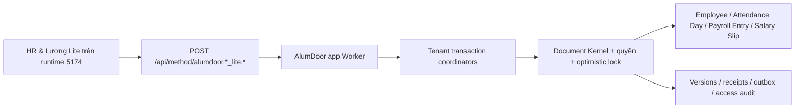
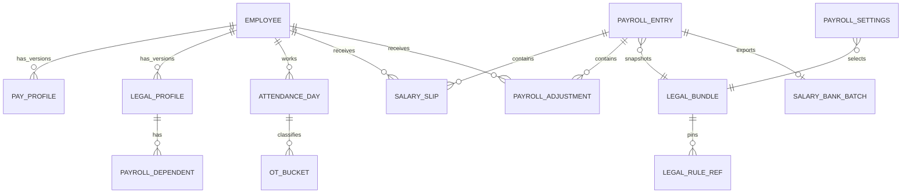
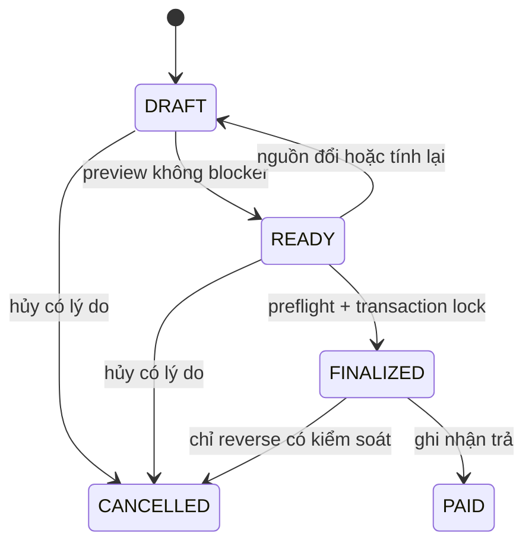

# Thiết kế kỹ thuật — AlumDoor HR & Lương Lite

- Phiên bản: `1.0-approved`
- Ngày: `13/08/2026`
- Trạng thái: Đã duyệt Cổng 3 ngày `13/08/2026`; chưa triển khai mã nguồn hoặc migration
- BRD nguồn: [ALUMDOOR-HR-PAYROLL-LITE-BRD-20260813.md](./ALUMDOOR-HR-PAYROLL-LITE-BRD-20260813.md)
- Field Ledger: [ALUMDOOR-HR-PAYROLL-LITE-FIELD-LEDGER-20260813.md](./ALUMDOOR-HR-PAYROLL-LITE-FIELD-LEDGER-20260813.md)
- Phạm vi: tenant AlumDoor, bề mặt đang chạy qua runtime ở cổng `5174`

## 0. Kết luận thiết kế

AlumDoor HR & Lương Lite là một **Experience riêng trên runtime hiện có**, không phải form Employee/Payroll Entry chung được ẩn bằng CSS. Nó giữ các chứng từ chuẩn làm nguồn thẩm quyền:

- `Employee`: hồ sơ nhân viên lõi.
- `AlumDoor Attendance Day`: bằng chứng ngày công đã duyệt.
- `AlumDoor Pay Profile`: mức lương theo phiên bản.
- `Payroll Entry`: aggregate kỳ lương.
- `Salary Slip`: phiếu lương từng người.
- `Salary Bank Batch`: danh sách chuyển khoản khi cần.

Luồng người dùng chỉ còn:

`Tạo nhân viên (3 trường) → Thiết lập lương → Tính thử → Chốt lương → Đánh dấu đã trả`.

Phòng ban không xuất hiện và không bắt buộc trong đường Lite. Tăng ca dùng chính sách cố định `50.000 VND/giờ`, tính theo phút được duyệt và chỉ làm tròn một lần. Trước khi chốt, rule engine vẫn kiểm tra mức trả này với sàn luật định theo từng bucket ngày thường/nghỉ/lễ/ban đêm.



## 1. Hiện trạng và ranh giới tương thích

### 1.1 Những gì giữ nguyên

- Runtime dùng `FrappeAdapterImpl` same-origin; Experience gọi `adapter.callPost(...)`.
- ABI vật lý của app là `POST /api/method/<dotted.method>` qua gateway và identity đã ký.
- App Worker không giữ D1 tenant; mọi ghi thẩm quyền đi qua callback tenant-worker.
- `documents`, `document_children`, `versions`, `mutation_receipts`, `outbox_events` tiếp tục là kho canonical.
- `Payroll Entry` và `Salary Slip` không bị thay bằng bảng tổng hợp riêng.
- Kỳ đã chốt tiếp tục khóa `AlumDoor Attendance Day` bằng transaction coordinator.

### 1.2 Những gì thay thế ở bề mặt AlumDoor

- Bỏ menu/form Employee chung khỏi nhóm điều hướng AlumDoor; power user vẫn có thể mở route kỹ thuật nếu được cấp quyền.
- Thay Experience payroll hiện tại bằng các mode Lite, không bắt người dùng nhập company/branch/ngày công chuẩn.
- Không dùng `overtime_multiplier_bp` cho phép tính Lite v2; field cũ chỉ còn để đọc lịch sử v1.
- Không render field bị cấm quyền thành `••••••`; DTO không chứa field đó.
- Không dùng Property Setter toàn tenant để hạ trường bắt buộc của Employee.

### 1.3 Logical REST và ABI vật lý

BRD dùng REST để mô tả use case. Triển khai giữ ABI app hiện tại để không tạo backend thứ hai:

| Khái niệm | Triển khai |
|---|---|
| `GET /api/alumdoor/...` | Một dotted method read-only; vẫn gọi bằng HTTP POST do ABI tương thích |
| `POST/PUT /api/alumdoor/...` | Một dotted method mutation hẹp |
| Auth | Gateway session → app entitlement/role → identity envelope đã ký |
| Tenant | Derive từ identity; cấm nhận `tenant_id` từ client |
| Ghi dữ liệu | App Worker → signed internal callback → tenant coordinator → Document Kernel |
| Lỗi | Envelope Lite thống nhất; adapter dịch legacy error trong giai đoạn chuyển tiếp |

Không mở `frappe.client.insert/save` trực tiếp cho Experience Lite.

## 2. ADR bắt buộc

### ADR-HR-001 — Experience riêng, không thu nhỏ form chung

- Thêm các mode `alumdoor-attendance:employees-lite`, `payroll-lite`, `my-slips-lite`, `hr-payroll-settings-lite`.
- UI chia theo use case, không render metadata form Employee chung.
- Generic Employee/Payroll Entry vẫn nguyên cho tenant/app khác.
- Sửa riêng lỗi title của `DoctypeWorkspace` là hạng mục nền độc lập; HR Lite không phụ thuộc vào workaround đó.

### ADR-HR-002 — Trusted Employee Lite path, không Property Setter

Employee metadata chung hiện yêu cầu department/designation/employment type/cost center. Đường Lite xử lý bằng coordinator + controller chuyên biệt:

1. Client chỉ gửi `employee_name`, `mobile`, `date_of_joining`, `idempotency_key`.
2. App Worker validate Zod và gọi callback nội bộ `commit_alumdoor_employee_lite`.
3. Callback resolve company/workplace từ Payroll Settings, cấp mã bằng `naming_series`, gắn marker server-only `alu_profile=LITE_V1` và service actor.
4. `EmployeeLiteController` chỉ nhận marker này khi actor có role hệ thống AlumDoor và request đến từ callback đã ký; nó cho phép `department/designation/employment_type/cost_center = null`.
5. Mọi create Employee khác vẫn đi qua validation metadata hiện tại.
6. Save Employee Lite về sau cũng phải qua method Lite; generic direct write không được dùng để vượt field policy.

Như vậy không tạo Employee song song, không tạo phòng ban giả và không làm yếu schema cho tenant khác.

### ADR-PAY-001 — Calculation v2 cố định 50.000đ/giờ

- Policy key: `ALU_OT_FIXED_50000_V2`.
- Rate snapshot trên kỳ và phiếu: `50_000` VND/giờ.
- Công thức: `round_half_up(total_approved_minutes × 50_000 / 60)`.
- Dùng `BigInt`; không dùng `Number`/float cho tiền thẩm quyền.
- Làm tròn sau khi cộng toàn bộ bucket của một phiếu, không làm tròn từng ca.
- Ví dụ chuẩn: `90 phút → 75.000 VND`.
- Dữ liệu v1 theo hệ số vẫn đọc/in được; không tự tính lại lịch sử bằng v2.

### ADR-PAY-002 — 50.000đ là policy, không phải miễn kiểm tra pháp lý

Mỗi phút OT phải được phân loại thành bucket:

- ngày: `REGULAR`, `WEEKLY_REST`, `PUBLIC_HOLIDAY`;
- thời điểm: `DAY`, `NIGHT`;
- nguồn: Attendance Day/segment đã duyệt;
- rule: legal bundle VERIFIED và hiệu lực tại `work_date`.

Rule engine tính `statutory_floor_vnd` cho từng bucket. Nếu tổng policy hoặc rate quy đổi thấp hơn sàn của bất kỳ bucket nào, tạo blocker `OT_RATE_BELOW_LEGAL_FLOOR` và cấm finalize. Hệ thống không tự đổi 50.000 thành mức khác.

### ADR-PAY-003 — Một nguồn thẩm quyền, snapshot bất biến

- Preview tạo/cập nhật Salary Slip draft từ snapshot nguồn.
- Finalize preflight lại, so `source_hash`, rồi submit/khóa toàn bundle.
- `Payroll Entry` FINALIZED và các `Salary Slip` FINALIZED bất biến về tiền.
- Sửa sau chốt bằng hủy có lý do hoặc adjustment kỳ mới; không update trực tiếp.
- `mark-paid` là dấu vận hành trả lương, chưa phải bút toán kế toán/GL trong MVP.

### ADR-PAY-004 — Owner-only là policy được kiểm soát

- `owner_only_mode=1`: Owner/Payroll Approver được chuẩn bị và chốt cùng kỳ.
- Audit vẫn lưu riêng `prepared_by/at` và `finalized_by/at`.
- Dedicated finalize coordinator xác nhận mode + role; không gọi generic workflow action để lách quyền.
- Khi `owner_only_mode=0`, `prepared_by` không được bằng `finalized_by` và chỉ Approver chốt.

### ADR-CONTRACT-001 — Zod contract dùng chung hai phía

PHA 5 sẽ thêm workspace package thuần `packages/alumdoor-hr-payroll-contract` và thêm `packages/*` vào `pnpm-workspace.yaml`. Package chứa:

- method constants;
- request/response/error Zod schemas;
- DTO projection types;
- enums/state machines;
- money/minute primitives.

Runtime và AlumDoor Worker import cùng package. Rule pháp lý và phép tính tiền vẫn được xác thực lại trong domain controller; Zod không thay thế permission/business validation.

### ADR-SEC-001 — Projection theo quyền và audit đọc nhạy cảm

- List nhân viên không query/return bank, PIT, BHXH hoặc mức lương.
- Self-scope resolve server-side bằng `Employee.user_id=session.user_id`.
- Download/export/bank batch/AI salary query ghi append-only access event.
- File nhạy cảm luôn `is_private=1`; download dùng URL ký ngắn hạn.
- Log không chứa token, password, full identity envelope hoặc full bank account.

## 3. Mô hình dữ liệu và quan hệ

### 3.1 Lưu vật lý

Không tạo một SQL table cho mỗi DocType. Mọi document tiếp tục map như sau:

- envelope → `documents`;
- payload business → `documents.payload_json`;
- bảng con → `document_children`;
- optimistic lock → `documents.version` + `expected_version`;
- idempotency → `mutation_guard`/`mutation_receipts`;
- history mutation → `versions` + `outbox_events`;
- mã tự động → `naming_series`.

Các expression index D1 chỉ là guard/query accelerator; controller vẫn kiểm tra ràng buộc nghiệp vụ trong transaction.

### 3.2 Sơ đồ quan hệ logic



### 3.3 Mapping DocType

| Thực thể logic | Vật lý | Quyết định |
|---|---|---|
| Employee | `Employee` | Tái sử dụng; thêm custom field Lite tối thiểu |
| Legal/payment profile | `AlumDoor Employee Legal Profile` | Custom DocType versioned, permlevel cao |
| Dependent | `AlumDoor Payroll Dependent` | Child của Legal Profile |
| Pay profile | `AlumDoor Pay Profile` | Tái sử dụng; calculation v2 bỏ multiplier ở UI |
| Payroll Settings | `AlumDoor Payroll Settings` | Custom singleton theo tenant |
| Attendance Day | `AlumDoor Attendance Day` | Tái sử dụng; department optional |
| OT bucket | `AlumDoor Overtime Bucket` | Child của Attendance Day |
| Payroll period | `Payroll Entry` | Tái sử dụng + custom field `alu_*` v2 |
| Salary Slip | `Salary Slip` | Tái sử dụng + snapshot/trace v2 |
| Adjustment | `AlumDoor Payroll Adjustment` | Custom submittable DocType |
| Legal bundle | `AlumDoor Payroll Legal Bundle` | Custom wrapper pin các rule nguồn |
| Legal rule ref | `AlumDoor Payroll Legal Rule Ref` | Child; reference VN Payroll Rule/VN Tax Ruleset |
| Salary assignment | `Salary Structure Assignment` + `Payroll Rule Input Value` | Tái sử dụng; bridge ẩn do server tạo |
| Legal rule sources | `VN Payroll Rule`, `VN Tax Ruleset` | Tái sử dụng nguyên nguồn/version/checksum |
| Bank export | `Salary Bank Batch` + child hiện có | Tái sử dụng; không tạo CSV staging riêng |
| Audit mutation | `versions`, `mutation_receipts`, `outbox_events` | Tái sử dụng |
| Audit read/export | `sensitive_access_events` | Bảng append-only mới |
| File | `files` + R2 | Tái sử dụng |
| Notification | `notification_log` | Tái sử dụng |
| AI trace | `ai_logs` | Tái sử dụng |

Chi tiết từng field, D1 type, Zod, UI, validate, autofill, quyền và ý nghĩa nằm trong Field Ledger.

### 3.4 Unique/FK/index bắt buộc

| Đối tượng | Guard |
|---|---|
| Employee | unique `(tenant, employee_number)`; index normalized mobile |
| Legal Profile | unique `(tenant, employee, effective_from)`; cấm khoảng hiệu lực chồng nhau |
| Pay Profile | `profile_key` unique; cấm hai APPROVED profile chồng hiệu lực |
| Attendance Day | unique `(tenant, employee, work_date)` |
| OT Bucket | unique `(parent_day, day_category, time_category, source_segment)` |
| Payroll Entry | unique active `(tenant, workplace, period_key)`; cấm kỳ chồng ngày |
| Salary Slip | unique `(tenant, payroll_entry, employee)` |
| Adjustment | unique id; không sửa khi LOCKED |
| Legal Bundle | checksum unique; cấm VERIFIED overlap cùng scope |
| Sensitive access | PK `(tenant, event_id)`; append-only trigger |

### 3.5 Dự thảo migration SQL — không thực thi ở PHA 3

```sql
CREATE UNIQUE INDEX IF NOT EXISTS idx_alu_employee_number
ON documents(tenant_id, json_extract(payload_json,'$.employee_number'))
WHERE doctype='Employee' AND json_extract(payload_json,'$.employee_number') IS NOT NULL;

CREATE INDEX IF NOT EXISTS idx_alu_employee_mobile
ON documents(tenant_id, json_extract(payload_json,'$.alu_mobile_normalized'))
WHERE doctype='Employee';

CREATE UNIQUE INDEX IF NOT EXISTS idx_alu_attendance_employee_date
ON documents(tenant_id,
  json_extract(payload_json,'$.employee'),
  json_extract(payload_json,'$.work_date'))
WHERE doctype='AlumDoor Attendance Day';

CREATE UNIQUE INDEX IF NOT EXISTS idx_alu_payroll_period_key
ON documents(tenant_id, json_extract(payload_json,'$.alu_period_key'))
WHERE doctype='Payroll Entry'
  AND json_extract(payload_json,'$.alu_state') <> 'CANCELLED';

CREATE UNIQUE INDEX IF NOT EXISTS idx_alu_salary_slip_period_employee
ON documents(tenant_id,
  json_extract(payload_json,'$.alu_payroll_entry'),
  json_extract(payload_json,'$.employee'))
WHERE doctype='Salary Slip';

CREATE TABLE IF NOT EXISTS sensitive_access_events (
  tenant_id TEXT NOT NULL,
  event_id TEXT NOT NULL,
  actor_user_id TEXT NOT NULL,
  action TEXT NOT NULL,
  entity_type TEXT NOT NULL,
  entity_id TEXT,
  field_classes_json TEXT NOT NULL CHECK(json_valid(field_classes_json)),
  filter_json TEXT NOT NULL DEFAULT '{}' CHECK(json_valid(filter_json)),
  row_count INTEGER NOT NULL DEFAULT 0 CHECK(row_count >= 0),
  reason TEXT,
  correlation_id TEXT NOT NULL,
  occurred_at TEXT NOT NULL,
  PRIMARY KEY (tenant_id, event_id)
) WITHOUT ROWID;

ALTER TABLE files ADD COLUMN classification TEXT NOT NULL DEFAULT 'GENERAL';
ALTER TABLE files ADD COLUMN checksum TEXT;
```

Migration thực tế phải kiểm tra cột trước khi `ALTER`, backfill checksum theo policy, có trigger chặn UPDATE/DELETE access audit, index thời gian/actor/entity và test chạy lần hai không đổi dữ liệu.

## 4. State machine

### 4.1 Employee

`ACTIVE → PAUSED → ACTIVE`; `ACTIVE|PAUSED → LEFT`; record nháp chưa có lịch sử mới được `ARCHIVED`. Không hard-delete.

### 4.2 Legal Profile và Pay Profile

`DRAFT → APPROVED → RETIRED`. APPROVED chỉ sửa bằng tạo version mới; khoảng hiệu lực không chồng.

### 4.3 Attendance Day

`OPEN → COMPLETE → APPROVED → LOCKED`; lỗi thành `EXCEPTION`; xử lý xong quay `COMPLETE`. Chỉ APPROVED được preview cuối; finalize chuyển thành LOCKED trong cùng bundle.

### 4.4 Payroll Adjustment

`DRAFT → APPROVED → LOCKED`; DRAFT có thể `REJECTED`. Owner-only có thể create+approve trong một confirm nhưng audit vẫn có hai event.

### 4.5 Payroll Entry



UI không hiển thị trạng thái kỹ thuật cũ `calculated/pending_approval/approved`; adapter migration map v1 để đọc lịch sử.

### 4.6 Salary Slip

Đi theo kỳ: `DRAFT → FINALIZED → PAID`; `CANCELLED` chỉ qua coordinator. Không có action độc lập làm slip lệch kỳ.

## 5. Thuật toán tính lương v2

### 5.1 Snapshot đầu vào

Mỗi nhân viên snapshot:

1. Employee active trong kỳ và workplace.
2. Pay Profile APPROVED hiệu lực.
3. Legal Profile/Dependent hiệu lực.
4. Attendance Day thuộc kỳ + OT Bucket APPROVED.
5. Adjustment APPROVED.
6. Payroll Settings và Legal Bundle VERIFIED.
7. Calendar/holiday version dùng tính standard days.

Thứ tự canonical được sort ổn định trước khi SHA-256; cùng input luôn cho cùng output/hash.

### 5.2 Lương theo công

- Monthly: `base_pay = round_half_up(base_salary × payable_work_fraction_bp / standard_work_days_bp)`.
- Daily: `base_pay = round_half_up(base_salary_per_day × payable_work_fraction_bp / 10000)`.
- `standard_work_days_bp` do server tính từ lịch; UI không cho nhập.
- Kỳ không có standard day hợp lệ là blocker, không suy đoán.

### 5.3 Tăng ca

```text
policy_ot_pay = round_half_up(sum(approved_bucket_minutes) × 50_000 / 60)
legal_floor = sum(rule_engine.floor_vnd(bucket, employee_hourly_basis, work_date))
```

- Trước khi tính tổng, từng bucket so sánh policy theo phân số `minutes × 50_000 / 60` với floor của chính bucket; chỉ cần một bucket thiếu là chặn.
- `legal_floor` tổng chỉ dùng trace/báo cáo; tiền trả policy vẫn chỉ làm tròn một lần ở tổng phiếu.
- Nếu bucket chưa phân loại: `OT_BUCKET_UNCLASSIFIED`.
- Nếu rule chưa VERIFIED/không hiệu lực: `LEGAL_RULE_UNVERIFIED`.
- Nếu policy rate dưới sàn bucket: `OT_RATE_BELOW_LEGAL_FLOOR`.
- Phiếu vẫn có thể preview để thấy chênh lệch nhưng kỳ không thể FINALIZED.

### 5.4 Khoản cộng/trừ

- Earning: fixed allowance + bonus/allowance adjustment APPROVED.
- Deduction: bảo hiểm + PIT + advance + damage/other legal adjustment APPROVED.
- `OTHER_LEGAL` bắt buộc rule code và evidence.
- Không có `manual deduction` tự do.
- Rule engine kiểm tra cap khấu trừ và `net_pay >= 0`.

### 5.5 Trace

Mỗi Salary Slip v2 lưu:

- `calculation_version=2`;
- `source_hash`;
- `formula_trace_json` theo schema version;
- `rule_trace_json` gồm rule id/checksum/effective date;
- snapshot rate 50.000, work fractions, OT buckets và từng adjustment.

UI chỉ diễn giải trace; không cho sửa JSON.

## 6. API contract

### 6.1 Envelope

Request mutation chung:

```json
{
  "idempotency_key": "uuid-or-stable-command-key",
  "expected_version": 3,
  "payload": {}
}
```

Success:

```json
{"ok":true,"data":{},"meta":{"correlation_id":"...","version":4}}
```

Error:

```json
{"ok":false,"error":{"code":"PAYROLL_SOURCE_CHANGED","message":"Dữ liệu nguồn đã thay đổi. Hãy tính lại kỳ lương.","fields":{},"correlation_id":"..."}}
```

HTTP semantics sau gateway: `400` malformed, `401` unauthenticated, `403` permission, `404`, `409` version/state/idempotency, `422` business validation, `429`, `500`. UI hiển thị tiếng Việt và correlation id, không stack trace.

### 6.2 Dotted methods và quyền

Ký hiệu: `O` Owner/Approver, `P` Payroll User, `T` Attendance Manager, `A` Accountant, `E` Employee self.

| Method vật lý | Payload chính | Quyền | RLS/ghi chú |
|---|---|---|---|
| `alumdoor.hr_lite.employee_list` | query,cursor,page_size,status | O/P/T | Basic projection; không lương/bank |
| `alumdoor.hr_lite.employee_get` | employee | O/P/T/E | E chỉ own basic |
| `alumdoor.hr_lite.employee_create` | name,mobile,joining,idempotency | O | Trusted create, server autofill |
| `alumdoor.hr_lite.employee_update` | employee,expected_version,basic fields | O/E-limited | E không đổi scope/status |
| `alumdoor.hr_lite.employee_end` | employee,date,reason,version | O | Không hard-delete |
| `alumdoor.hr_lite.employee_invite` | employee,idempotency | O | User cùng tenant |
| `alumdoor.hr_lite.legal_profile_get` | employee,effective_date | O/P/A/E | Projection theo role |
| `alumdoor.hr_lite.legal_profile_save` | employee,profile,version | O/P/A-limited/E-propose | Field allowlist |
| `alumdoor.hr_lite.pay_profile_get` | employee,date | O/P/A/E | A final-only; E current own |
| `alumdoor.hr_lite.pay_profile_save` | employee,profile,version | O/P | DRAFT/versioned |
| `alumdoor.hr_lite.pay_profile_approve` | profile,version | O | Legal minimum precheck |
| `alumdoor.payroll_lite.settings_get` | — | O/P/A | Projection |
| `alumdoor.payroll_lite.settings_save` | settings,version | O | Audit before/after |
| `alumdoor.payroll_lite.period_list` | year,state,cursor | O/P/A | Tenant/workplace |
| `alumdoor.payroll_lite.period_preview` | period_key,idempotency | O/P | Upsert DRAFT, no lock |
| `alumdoor.payroll_lite.period_get` | period | O/P/A | Role projection |
| `alumdoor.payroll_lite.period_recalculate` | period,source_hash,version | O/P | DRAFT/READY only |
| `alumdoor.payroll_lite.period_blockers` | period,scope | O/P/T/A | T only attendance; A no private HR |
| `alumdoor.payroll_lite.period_finalize` | period,source_hash,version,idempotency | O | Preflight + atomic bundle |
| `alumdoor.payroll_lite.period_cancel` | period,reason,version | O | State policy + audit |
| `alumdoor.payroll_lite.period_mark_paid` | period,paid_date,reference,version | O/A | FINALIZED only |
| `alumdoor.payroll_lite.period_slips` | period,cursor | O/P/A | No bank in generic DTO |
| `alumdoor.payroll_lite.slip_get` | slip | O/P/A/E | E own FINALIZED/PAID |
| `alumdoor.payroll_lite.slip_pdf` | slip | O/P/A/E | Private download + audit |
| `alumdoor.payroll_lite.adjustment_create` | period,employee,type,amount,reason,evidence | O/P | DRAFT/READY |
| `alumdoor.payroll_lite.adjustment_approve` | adjustment,version | O | Rule/evidence check |
| `alumdoor.payroll_lite.period_export` | period,filters,columns | O/P/A | Export toàn bộ filter, không chỉ page |
| `alumdoor.payroll_lite.bank_transfer_export` | period,bank_account,date | O/A | FINALIZED; audit full bank access |
| `alumdoor.attendance_lite.day_approve` | day,version,reason? | O/T | Không locked |
| `alumdoor.hr_payroll.ai_query` | question,context | O/P/T/A/E | Read-only tool allowlist |

### 6.3 Callback nội bộ

| Callback | Vai trò |
|---|---|
| `metaforge.api.commit_alumdoor_employee_lite` | Employee + mã + audit atomically |
| `metaforge.api.save_alumdoor_pay_profile_v2` | Version profile + hidden Salary Structure Assignment compatibility |
| `metaforge.api.preview_alumdoor_payroll_v2` | Snapshot, rule engine, upsert slips/entry draft |
| `metaforge.api.finalize_alumdoor_payroll_v2` | Recheck hash, lock attendance, submit entry/slips, lock adjustments |
| `metaforge.api.mark_alumdoor_payroll_paid_v2` | Entry/slips paid + payment reference + notify |

Mỗi callback chỉ nhận identity đã ký, kiểm audience/app/expiry/signature và không public qua app nav.

### 6.4 Pagination/export/optimistic lock

- List dùng cursor, `page_size` mặc định 50, tối đa 200.
- Export query lại toàn bộ tập đã lọc với cap cấu hình; không export chỉ trang đang xem.
- Mutation gửi `expected_version`; 409 trả `latest_version` và snapshot projection phù hợp quyền.
- Finalize ngoài version còn bắt buộc `source_hash` để phát hiện dữ liệu con thay đổi.

### 6.5 Offline và `/api/sync`

Không mở `/api/sync` cho mutation lương vì finalize/paid là thao tác tài chính và phải online. PWA chỉ:

- cache shell và read gần nhất có nhãn thời gian;
- giữ form draft không nhạy cảm cục bộ;
- cấm create/save salary, finalize, paid và download mới khi offline.

Quyết định này là N/A có chủ đích, không phải thiếu endpoint.

## 7. Permission/RLS chi tiết

| Lớp | Bảo vệ |
|---|---|
| Gateway | session, entitlement app, CSRF/rate limit |
| App Worker | verify signed identity, method allowlist, Zod request |
| Coordinator | derive tenant, role/use-case policy, self/workplace scope |
| Document Kernel | DocType/action/field permission, expected version, lifecycle |
| Query/DTO | allowlist field projection; không `SELECT *` rồi che UI |
| File | private metadata + signed short URL + entity permission |
| Audit | mutation trong transaction; read/export append-only |

Owner thấy toàn module. Payroll không được thay quyền/setting nhạy cảm hoặc finalize. Attendance không thấy tiền. Accountant chỉ thấy kỳ finalized/payment data cần thiết. Employee chỉ thấy hồ sơ cơ bản và phiếu của chính mình.

## 8. Kiến trúc UI

### 8.1 Cấu trúc component dự kiến

```text
client/apps/runtime/src/experiences/alumdoor-hr-payroll/
  AlumdoorHrPayrollExperience.tsx
  EmployeesLiteScreen.tsx
  EmployeeDetailPane.tsx
  EmployeeFormDrawer.tsx
  PayProfileDrawer.tsx
  PayrollLiteScreen.tsx
  PayrollPeriodList.tsx
  PayrollResultsTable.tsx
  PayrollBlockersPanel.tsx
  SalarySlipDetail.tsx
  MySalarySlipsScreen.tsx
  HrPayrollSettingsScreen.tsx
  mobile/
  schemas-and-presenters.ts
```

State/data access nằm ở hooks/use-case services; component không tự gọi method tùy ý. Không thêm một design system thứ hai.

### 8.2 Desktop

- `Nhân viên`: table full-width; chọn row mới chuyển layout 3 cột.
- Form tạo: `FormDrawer` 680px, đúng 3 field.
- `Tính lương`: trái kỳ, giữa KPI+bảng 6 cột nghiệp vụ, phải blockers/formula.
- 1024–1279px: pane phải thành drawer.
- Header toolbar theo chuẩn `Primary → Quick filter/Search → Advanced filter → Ask AI → Print/Export`.

### 8.3 Mobile

- Không co bảng desktop; dùng card list riêng.
- BottomNav/FAB từ shell chung.
- Form full-screen; action bar sticky trong vùng ngón cái.
- Payroll card chỉ có tên, công, OT, thực nhận, trạng thái.
- Finalize/paid luôn confirm và disabled khi offline/loading.

### 8.4 Control contract

| Dữ liệu | Control chuẩn |
|---|---|
| Tên/SĐT/lý do | Input/Tel/Textarea |
| Ngày | DatePicker |
| Cách trả | Segmented/Select enum |
| Tiền VND | MoneyInput, integer |
| Employee/rule/file | LinkField/FileField có permission |
| Bộ lọc | Search + FilterBuilder |
| Trạng thái | Badge + action hợp lệ, không cho sửa Select trực tiếp |
| Bảng | DataTable desktop; Card list mobile |

### 8.5 Visual preset

Áp dụng preset `san-xuat`:

- primary steel `#334155`;
- secondary slate;
- accent safety yellow `#EAB308` với chữ đen;
- vàng/đỏ chỉ cho cảnh báo;
- chữ kỹ thuật ngắn, rõ; ưu tiên nhãn tiếng Việt.

Brand token hiện hữu của app thắng nếu đã được khách duyệt; không hard-code rải rác trong component.

### 8.6 Trạng thái màn hình

Mọi screen có loading skeleton, empty, filtered-empty, error+retry, no-permission, saved/success và offline. 403 không render khung/label dữ liệu nhạy cảm. 409 giữ dữ liệu form và đưa action `Tải bản mới`/`So sánh`.

## 9. Server pattern và hạ tầng

### 9.1 Middleware/checklist

- identity signature/audience/expiry;
- tenant + app entitlement;
- role và self/workplace scope;
- Zod request/response;
- idempotency + optimistic version;
- correlation id;
- mutation/read audit;
- structured error không lộ nội bộ;
- private field projection.

### 9.2 Hạ tầng tái sử dụng

| Nhu cầu app-factory | Quyết định |
|---|---|
| audit logs | `versions/receipts/outbox` cho mutation + `sensitive_access_events` cho read/export |
| counters | dùng `naming_series`, không tạo bảng counter mới |
| files | dùng `files` + R2 private |
| notifications/message log | dùng `notification_rules` + `notification_log` |
| AI logs | dùng `ai_logs` |
| webhooks | N/A; không nhận webhook thanh toán trong MVP |

### 9.3 Notification

- Khi finalize: in-app notify nhân viên đã liên kết user rằng có phiếu mới; không đưa số tiền vào preview message.
- Khi paid: notify trạng thái đã trả.
- Khi kỳ có blocker: notify Owner/Payroll, không notify Employee.
- Zalo/email adapter chỉ bật sau khi có consent/template; mặc định in-app.

### 9.4 Ba lịch vận hành

Không tạo Worker cron trùng. Đăng ký job module vào scheduler hiện có:

1. Sáng: kiểm tra kỳ đến hạn trả/chưa trả và hồ sơ lương sắp hết hiệu lực.
2. Chiều: tổng hợp blocker kỳ đang mở cho Owner, tối đa một notify/ngày/kỳ.
3. Đêm: tham gia maintenance/backup hiện có; verify snapshot/audit integrity, không tự đổi số lương.

### 9.5 AI tool coverage

Tool read-only bao phủ toàn bộ use case đọc chính:

- `list_employees`, `find_employee`, `employee_counts`;
- `employees_missing_pay_profile`, `employees_missing_legal_profile`;
- `payroll_period_summary`, `payroll_blockers`, `payroll_overtime_summary`;
- `payroll_compare_periods`, `payroll_unpaid_periods`;
- `explain_salary_slip`.

Mỗi tool dùng cùng query service/RLS/DTO với màn hình, ghi `ai_logs` và sensitive access event khi chạm dữ liệu lương. Tool không create/update/finalize/paid.

## 10. Rule pháp lý và kế toán

### 10.1 Rule bundle

`AlumDoor Payroll Legal Bundle` không chứa code thực thi. Nó pin checksum của:

- `VN Payroll Rule`: lương tối thiểu, OT, đêm, giới hạn khấu trừ;
- `VN Tax Ruleset` loại `PIT`;
- `VN Tax Ruleset` loại `Insurance`.

Chỉ bundle `VERIFIED` và hiệu lực mới được finalize. Rule payload phải có test vector và nguồn chính thức. `need_legal_check=true` còn là production blocker.

### 10.2 Salary Structure Assignment

Engine chuẩn hiện yêu cầu Salary Structure Assignment. UI Lite không lộ đối tượng này. Khi Pay Profile được APPROVED, callback `ensureSalaryAssignment` tạo/version hóa SSA tương thích từ hidden Payroll Settings:

- company/workplace;
- salary structure;
- cost center/accounts/holiday list;
- legal rule references;
- **không yêu cầu department** trong trusted AlumDoor payroll controller path.

Không tạo master Department giả. Generic SSA ngoài đường Lite giữ validation hiện tại.

### 10.3 Posting kế toán

MVP chỉ tính/chốt/trả vận hành, chưa tự tạo GL/Payment Entry. `mark-paid` phải được ghi nhãn rõ “Đánh dấu đã trả”, không gọi là “Đã hạch toán”. Pha tích hợp kế toán sau sẽ map earning/deduction component và posting theo chế độ kế toán đã cấu hình; không suy diễn tài khoản trong module Lite.

## 11. Migration, backfill, rollout và rollback

### 11.1 Migration idempotent

Thứ tự dự kiến sau Cổng 4:

1. Cài metadata DocType/Custom Field/roles/workflows v2.
2. Tạo expression indexes và `sensitive_access_events`.
3. Seed Payroll Settings draft từ company/workplace hiện tại; không tự VERIFIED legal bundle.
4. Backfill `alu_profile=LEGACY` cho Employee cũ; không đổi department.
5. Backfill calculation version `1` cho period/slip cũ.
6. Tạo v2 Pay Profile từ record cũ ở trạng thái DRAFT để Owner kiểm tra; không auto-approve nếu multiplier khác policy mới.
7. Dry-run report: missing profile/legal/workplace/rule/buckets.
8. Apply có tenant flag, receipt và chạy lại không nhân đôi.

### 11.2 Rollout

- Feature flag tenant: `hr_payroll_lite_v2`.
- Shadow preview: v2 tính song song nhưng không ghi/chốt; đối chiếu v1 cho một kỳ mẫu.
- Owner UAT 5 nhân viên → 30 nhân viên.
- Bật nav Lite; giữ route legacy chỉ System Manager trong một release.
- Sau sign-off, chặn tạo kỳ mới bằng v1; lịch sử v1 vẫn read-only.

### 11.3 Rollback

- Tắt feature flag/nav Lite.
- Không xóa DocType/field/index hay dữ liệu v2.
- Kỳ v2 đã FINALIZED/PAID vẫn đọc/in được; không downgrade công thức.
- Chỉ rollback UI/method routing; schema additive được giữ.

## 12. Kiểm thử và verify

### 12.1 Unit/domain

- Phone/name/date normalization.
- Employee Lite trusted marker/actor; direct spoof phải 403/422.
- Pay Profile overlap/effective date.
- BigInt half-up: 1, 30, 59, 60, 90 phút.
- Monthly/daily calculation.
- OT buckets ngày thường/nghỉ/lễ/đêm và floor blocker.
- PIT/insurance/deduction cap theo legal test vectors.
- Source hash deterministic.
- State machine và immutable finalized records.

### 12.2 Integration/security

- Tenant isolation và self-scope.
- Field projection không salary/bank khi role không có quyền.
- Idempotent create/preview/finalize/paid.
- 409 version/hash conflict.
- Finalize bundle rollback toàn bộ nếu một slip lỗi.
- Attendance/adjustment lock cùng transaction.
- Private PDF/bank export audit.
- Append-only triggers chặn audit update/delete.

### 12.3 E2E/visual

- Tạo nhân viên 3 field dưới 45 giây.
- Tạo Pay Profile dưới 60 giây.
- Kỳ 30 người không blocker dưới 5 phút thao tác.
- Desktop 1280/1440/1920 và mobile 360/390/430.
- Không bảng ngang mobile; footer action không bị che.
- Loading/empty/filter/error/403/409/offline.
- Phiếu A5/A4, QR auth-only, chỉ 4 số cuối tài khoản.

### 12.4 Gate verify dự kiến

- Typecheck client/server.
- Unit + worker tests + SQL migration tests.
- Contract tests chung Zod.
- Targeted E2E cho Employee/Payroll/Self-slip.
- Build production runtime.
- Visual QA bằng screenshot thực tế tại cổng dev; không chỉ DOM assertions.

## 13. Phân lát triển khai sau khi duyệt Cổng 3

1. Contract package + metadata additive + migration tests.
2. Employee Lite server path + UI Nhân viên.
3. Pay/Legal profile + Settings + hidden SSA compatibility.
4. Calculation v2 + legal buckets/blockers + preview.
5. Atomic finalize/paid + PDF/bank export/notifications.
6. AI read tools + reports + mobile polish.
7. Backfill/shadow/UAT/feature-flag rollout.

Mỗi slice phải xanh targeted tests trước khi chuyển slice tiếp theo. Migration/apply tenant và deploy chỉ thực hiện ở các cổng sau.

## 14. Điều kiện qua Cổng 3

- [x] Kiến trúc bám runtime/app Worker/tenant kernel hiện có.
- [x] Không tạo HR/payroll storage song song.
- [x] Có phương án không phòng ban mà không Property Setter toàn tenant.
- [x] Công thức 50.000đ/giờ, BigInt, làm tròn và legal floor rõ ràng.
- [x] Có data mapping, unique/FK/index và migration draft.
- [x] Có API dotted methods, payload, role/RLS, error, idempotency và optimistic lock.
- [x] Có desktop/mobile/component/control/state/visual preset.
- [x] Có cron, notifications, audit, files, AI coverage và offline decision.
- [x] Có migration/backfill/rollback/test plan.
- [x] Field Ledger đủ 9 cột được lập riêng.
- [ ] Kế toán/pháp lý xác nhận Legal Bundle trước production; không chặn Cổng 3 nhưng chặn go-live.
- [x] Người dùng duyệt Cổng 3 ngày 13/08/2026 để chuyển sang chuẩn bị nhánh/cổng kiểm tra.
