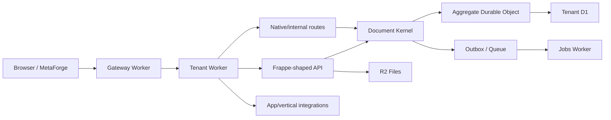

# Kiến trúc Forge

Ngày cập nhật: **2026-08-16**.

Đây là canonical architecture document. `SENTRUX_MAP.md` bổ sung góc nhìn navigation/ownership cho agent; exact code và migration thắng tài liệu nếu có drift.

## 1. Hình dạng repo

```text
forge/
├─ apps/
│  └─ alumdoor/                 # vertical composition
├─ client/
│  ├─ apps/                     # runtime, mobile, demo/domain apps
│  └─ packages/                 # adapter, core, controls, views, shell, ui...
├─ server/
│  ├─ apps/                     # Cloudflare Workers / runtime entrypoints
│  ├─ apps-src/                 # app worker/source packages
│  ├─ packages/                 # kernel, API, ERP/domain/platform services
│  ├─ migrations/               # tenant/control/jobs schema history
│  ├─ briefs/                   # app/metadata manifests
│  ├─ scripts/                  # build/install/migrate/release/deploy tooling
│  └─ tests/                    # server verification
├─ docs/                        # contracts, architecture, ops, evidence
├─ skills/                      # agent execution/routing policy
├─ qa/ + validation/            # validation assets/gates
├─ .github/workflows/           # CI/release/Sentrux automation
└─ .sentrux/rules.toml          # structural guardrails
```

Generated/cache/dependency output không phải source architecture: `node_modules`, `dist`, `build`, coverage, temp/work directories và generated artifacts phải được xử lý theo ignore/generator policy của scope tương ứng.

## 2. Runtime flow



Gateway chịu trách nhiệm routing/trusted tenant dispatch. Tenant Worker compose authenticated API/runtime boundary. Frappe facade dịch compatibility shape; business authority vẫn thuộc kernel/domain layer.

## 3. Server entrypoints

Các runtime app hiện nằm dưới `server/apps/`, gồm:

- `gateway-worker/` — host/assets routing và trusted tenant dispatch;
- `tenant-worker/` — tenant API/runtime composition;
- `query-worker/` — prepared/report query workload;
- `jobs-worker/` — queue/scheduled background processing;
- `control-plane-worker/` — tenant/provisioning/control state;
- `social-ingress-worker/` — OAuth/webhook/social ingress;
- `workflow-worker/` — workflow-oriented processing;
- `purchase-qa-callback/` — bounded integration callback;
- `web/` — server web surface theo implementation hiện hành.

Entry file cụ thể phải được resolve từ package/app config hiện tại, không hard-code trong docs khi refactor có thể di chuyển nó.

## 4. Shared server packages

Các nhóm authority quan trọng dưới `server/packages/**`:

- `document-kernel/` — canonical document mutation/lifecycle path;
- `frappe-api/` — Frappe-shaped API compatibility facade;
- `frappe-model/` — metadata/model/permission semantics;
- `app-registry/` — app manifest/install/registry lifecycle;
- `auth/` — authentication/security primitives;
- `core/`, `contracts/` — shared platform contracts/types;
- `clouderp-*` — ERP/domain authorities như core, ERPNext compatibility, pricing, selling, stock;
- integration/platform packages — bounded services không được trở thành shadow business authority.

Package barrel/index chỉ nên export public API. Business logic và dependency-heavy internals nên được import qua leaf/bounded modules để tránh fan-out và depth tăng không cần thiết.

## 5. Frontend architecture

`client/apps/runtime` là shared production runtime chính. `client/apps/` còn có bounded mobile/domain/demo surfaces. Shared packages hiện gồm các nhóm như:

- `adapter-frappe/` — API compatibility boundary;
- `core/` — metadata/types/resolution primitives;
- `controls/` — field/control rendering;
- `views/` — list/form/report/workspace containers and view contracts;
- `shell/` — auth/navigation/app shell;
- `ui/`, `visual/`, `charts/` — presentation primitives;
- `builder/` — metadata builder;
- `stock-vn/` — bounded VN stock/report UI integration;
- `create-metaforge-app/` — scaffolding/tooling.

Frontend không phải security authority. Role/DocPerm/tenant enforcement vẫn phải xảy ra server-side.

## 6. Document and data authority

### Write path

API/controller/service -> Document Kernel -> aggregate serialization/Durable Object khi cần -> D1 + outbox/side effects.

Không bypass write path để ghi trực tiếp document/ledger nếu việc đó bỏ qua lifecycle, OCC, idempotency, permission, workflow hoặc audit.

### Read path

API/service/query -> authoritative tenant store/read model. Read projection không tự trở thành write authority.

### Shared ledgers

- Finance dùng canonical GL + Payment Ledger.
- Inventory dùng canonical Stock Ledger/valuation/reservation authority.
- Vertical/domain không tạo shadow ledger để giải bài toán local.

## 7. App và vertical boundary

App/vertical compose shared capability qua App Registry/App Factory, manifests/briefs và bounded packages. Reusable business behavior phải nằm ở platform/domain package; vertical chỉ giữ schema/logic thực sự đặc thù ngành.

Alumdoor là reference vertical nhưng không được fork Finance, Stock, Payroll, Pricing hoặc generic Sales/Manufacturing authority.

## 8. Migration và release

Migration history có khả năng applied là append-only. Không sửa migration cũ để “làm sạch” nếu có khả năng đã chạy ở môi trường thực.

Merge source không chứng minh deploy. Release claim cần exact source/release identity và evidence tương ứng. Production deploy, migration, restore/PITR, DNS/route/secret/provider mutation và customer-data write/cutover cần explicit authorization.

## 9. Dependency discipline

- Ưu tiên leaf imports ở hotspot thay vì root barrel lớn.
- Không tạo cycle để giảm số file hay rút ngắn import tạm thời.
- Tách registry/router/controller theo bounded responsibility khi god-file/fan-out tăng.
- Shared core không phụ thuộc ngược vào app/vertical.
- Client không import server implementation; giao tiếp qua contract/API.
- Server business/domain package không import React/client runtime.
- Generated/source-data artifacts phải có generator/owner rõ và không trộn vào handwritten core.

Machine-readable guardrails bắt đầu tại `.sentrux/rules.toml`; navigation/ownership chi tiết tại `../SENTRUX_MAP.md`.

## R8 receipt-specific operation costs

Manufacture Stock Entry may capitalize explicit labor/machine/overhead clearing amounts.
The rollout controller applies a bounded helper to the existing mutation plan, replacing
standard operation value once and committing Stock/GL together. Exact stored reversal
remains under Document Kernel; Job Card accrual, WIP allocation and variance/rework rules
remain separate business contracts.
