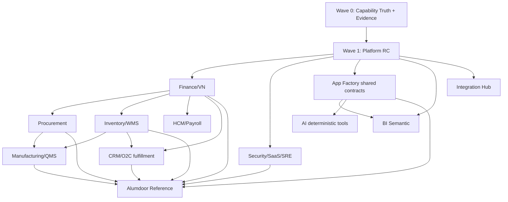

# FORGE RC HARDENING EXECUTION BLUEPRINT — 2026-08-03

Status: **PROPOSED PROGRAM / NOT YET MERGED**  
Baseline rule: trước mỗi task phải đọc lại exact current `main`; không dùng SHA/branch trong tài liệu này làm live truth dài hạn.  
Execution policy: `skills/forge-enterprise-completion/SKILL.md`.  
Strategic target: `docs/FORGE_ENTERPRISE_NORTH_STAR.md`.  
Capability denominator: `docs/FORGE_ENTERPRISE_CAPABILITY_MAP.md` (**956 capability IDs** tại thời điểm lập kế hoạch).  
Current platform assessment: **overall Wired, moving into RC hardening**.

---

# 1. Mục tiêu chương trình

Forge đã qua giai đoạn thiếu module. WS00–WS17 đã hội tụ ở repository level, ERP/domain breadth đã rộng, App Factory/runtime/tenant foundation đã có, Alumdoor đã chứng minh được verticalization và production delivery ở nhiều mốc trước đây.

Giai đoạn tiếp theo không lấy số màn hình, số DocType hoặc số PR làm thước đo. Mục tiêu là đưa Forge từ trạng thái **Wired rộng** sang **RC có bằng chứng**, sau đó chọn các capability quan trọng nhất để lên **Hardened**.

Chương trình phải đạt đồng thời 7 kết quả:

1. Có live maturity register cho đủ 956 capability ID.
2. Có evidence index để biết capability nào đang dựa vào code/test/migration/release proof nào.
3. L0 Platform đạt RC trước khi domain tiếp tục tự mở rộng primitive riêng.
4. ERP Core đạt business-complete theo flow, không chỉ có schema + UI.
5. Finance/stock/payroll/security/migration có correction, reconciliation và tenant evidence theo chuẩn CRITICAL.
6. App Factory + AI trở thành moat generic, không special-case vertical vào runtime chung.
7. Alumdoor đạt reference-vertical acceptance đủ mạnh để chứng minh platform hiện hành, không dựa vào release evidence lịch sử.

Program exit target theo North Star:

| Layer | Target program exit |
|---|---:|
| L0 Platform | >= 95% capability trong scope selected đạt RC+, critical write/security/release path đạt Hardened khi có production proof |
| L1 ERP Core | >= 90% capability selected đạt business-complete RC+ |
| L2 Enterprise Depth | >= 75–85% capability selected đạt Wired/RC tùy domain |
| L3 Alumdoor reference vertical | >= 95% capability VP01 trong scope vận hành được chốt đạt RC+, production paths quan trọng đạt Hardened |

Không dùng target trên để suy ngược phần trăm hiện tại. Chỉ tính sau khi Capability Status Registry đủ mẫu số.

---

# 2. Các điều không làm trong phase này

1. Không mở thêm vertical mới chỉ để demo.
2. Không làm lại feature đã có nếu audit chưa chứng minh current implementation thiếu.
3. Không reopen PR cũ làm canonical task.
4. Không nâng maturity chỉ vì có test hoặc đã merge.
5. Không đẩy business rule xuống React để né backend contract.
6. Không tạo stock/money/payroll ledger song song.
7. Không hard-code Alumdoor/Item Price/business names vào shared runtime nếu metadata diễn đạt được.
8. Không triển khai AI write path nếu deterministic tool/permission/preview/approval chưa khóa.
9. Không gọi current main là deployed nếu không có exact release marker/evidence.
10. Không biến GitHub Actions thành full-CI khổng lồ nếu blast-radius validation nhỏ hơn đã đủ evidence.

---

# 3. Operating model

## 3.1 Một task chỉ tồn tại khi có Capability IDs

Mọi branch/PR/task mới phải khai báo:

```text
Program: RC Hardening
Capabilities: <ID list>
Current maturity: <per ID or grouped>
Target maturity: <per ID or grouped>
North Star pillar: <NS-xx>
Risk: FAST | STANDARD | CRITICAL
Authoritative source: <domain/controller/ledger/store>
Dependencies: <capability / branch / shared contract>
Evidence required: <tests / migration / permission / reconciliation / E2E / release>
Rollback/correction path: <required when applicable>
```

Không có Capability ID phù hợp thì cập nhật Capability Map trước. Không tạo feature mồ côi.

## 3.2 Branch policy

Mọi implementation bắt đầu từ exact current `main`.

Naming:

```text
rc/<wave>-<domain>-<slice>
```

Ví dụ:

```text
rc/w0-capability-status
rc/w1-release-sre
rc/w2-finance-period-reconcile
rc/w2-inventory-repost
rc/w4-appfactory-action-input
rc/w5-alumdoor-o2c-proof
```

Không tiếp tục `agent/*`, `feat/*`, `fix/*` cũ như canonical nếu task mới chưa audit exact diff.

## 3.3 PR policy

PR description tối thiểu có:

```text
Capabilities:
Maturity before -> after:
Risk:
Source of truth:
Invariants:
Changed contracts:
Correction/reversal:
Permission/tenant evidence:
Tests:
Migration replay:
Reconciliation:
Browser/mobile evidence:
Production evidence:
Dependencies / Dependency Requests:
Known remaining gaps:
```

UI-only có thể merge/deploy theo UI policy sau verify. Non-UI/shared/backend/schema/migration/security/accounting/stock/payroll/ops dừng trước merge/deploy cho tới khi có approval rõ.

## 3.4 Không block toàn chương trình vì một blocker cục bộ

Nếu một task cần shared contract thuộc owner khác:

1. ghi `Dependency Request`;
2. tách phần độc lập;
3. tiếp tục phần độc lập;
4. chỉ block slice thật sự phụ thuộc.

---

# 4. Capability Status Registry

Canonical file phải được tạo ở Wave 0:

`docs/FORGE_ENTERPRISE_CAPABILITY_STATUS.md`

## 4.1 Schema một capability

| Field | Bắt buộc | Nội dung |
|---|---:|---|
| ID | yes | ID từ Capability Map |
| Family | yes | F01, W01, B02... |
| North Star | yes | NS-01..NS-12 hoặc cross-cutting |
| Maturity | yes | Missing/Foundation/Wired/RC/Hardened |
| Risk | yes | FAST/STANDARD/CRITICAL |
| Authoritative source | yes nếu Wired+ | controller/service/ledger/package |
| UI surface | nếu có | renderer/screen/app |
| Permission evidence | nếu Wired+ | server check/test |
| Correction evidence | nếu transactional | cancel/reverse/amend/retry |
| Reconciliation evidence | finance/stock/payroll/data | exact test/report/script |
| Migration evidence | nếu schema | migration + replay |
| Browser/mobile evidence | nếu actor UI | E2E/screenshot/run |
| Production evidence | nếu claim deployed | release SHA/bundle marker/run |
| Blocking gap | yes nếu < Hardened | gap ngắn nhất |
| Next slice | yes nếu < RC | smallest maturity-lifting slice |
| Last audited main | yes | exact SHA tại thời điểm audit |

## 4.2 Maturity promotion rules

### Missing -> Foundation

Cần tối thiểu:
- canonical schema/contract hoặc platform seam;
- ownership/layer đúng kiến trúc;
- không tạo duplicate authority.

### Foundation -> Wired

Cần:
- end-to-end happy path chạy qua authoritative write/read path;
- server permission/tenant boundary;
- basic failure validation;
- UI/API route thực tế nếu capability yêu cầu.

### Wired -> RC

Cần:
- invariant tests;
- failure/retry/idempotency;
- cancel/reversal/correction khi nghiệp vụ cần;
- migration replay nếu schema;
- reconciliation nếu finance/stock/payroll;
- browser/mobile acceptance nếu có UI;
- known long-tail được ghi rõ, không giả vờ Hardened.

### RC -> Hardened

Cần:
- production-grade scope được công bố rõ;
- failure/correction/security/reconciliation đầy đủ trong scope đó;
- performance/large-data behavior phù hợp actor;
- current release proof nếu claim deployed;
- observability/rollback/backup/migration evidence khi liên quan;
- không còn blocker Critical trong scope Hardened.

---

# 5. Hệ thống ưu tiên thay vì chọn task cảm tính

Mỗi capability/slice được cho điểm ưu tiên để coordinator chọn batch tiếp theo.

## 5.1 Priority score

Score 0–5 cho từng yếu tố:

| Yếu tố | Trọng số |
|---|---:|
| Blocker cho end-to-end flow | x5 |
| Financial/legal/security/data risk | x5 |
| Reuse cho nhiều app/domain | x4 |
| Dependency centrality | x4 |
| Customer/Alumdoor value | x3 |
| Migration/onboarding value | x3 |
| Evidence gap đang chặn RC | x3 |
| Implementation cost | x-2 |
| Shared-contract conflict risk | x-2 |

Formula:

```text
Priority =
5*FlowBlocker +
5*RiskReduction +
4*Reuse +
4*DependencyCentrality +
3*CustomerValue +
3*MigrationValue +
3*EvidenceGap -
2*ImplementationCost -
2*ConflictRisk
```

Không dùng score như luật cứng. Nó dùng để tránh việc feature dễ demo luôn thắng capability khó nhưng quan trọng.

## 5.2 P0/P1/P2

- **P0:** blocker cross-domain, security/ledger/data integrity, release truth, capability evidence system.
- **P1:** ERP core RC slice trực tiếp tạo business completeness.
- **P2:** enterprise depth/moat/UX breadth sau khi source/core đủ ổn.

---

# 6. Dependency graph chương trình



Shared dependency order mặc định:

1. Capability truth/evidence.
2. Kernel/security/SaaS/SRE/release.
3. App Factory generic contracts.
4. Finance + Inventory authorities.
5. Procurement/CRM/HCM.
6. Manufacturing/QMS.
7. Enterprise depth.
8. AI/tooling moat.
9. Alumdoor current-main production proof.

---

# 7. Concurrency model

Không quay lại mô hình 18 nhánh cùng sửa shared files.

## 7.1 Tối đa 5 lane active

| Lane | Scope | Shared hotspot rule |
|---|---|---|
| Lane A | Platform/Security/SRE | owns release/kernel/security contract trong batch |
| Lane B | Finance/VN | owns financial contracts |
| Lane C | Inventory/Procurement | không đổi finance authority nếu chưa Dependency Request |
| Lane D | CRM/HCM/Manufacturing | chỉ chạy slice độc lập khỏi shared hotspot |
| Lane E | App Factory/UI/Alumdoor evidence | metadata/runtime only theo ownership rõ |

Một shared hotspot chỉ có một canonical writer tại một thời điểm.

## 7.2 Merge window

Sau mỗi batch:

1. freeze shared contract changes;
2. rebase remaining branches lên current main;
3. rerun affected evidence;
4. cập nhật Capability Status;
5. mở batch kế tiếp.

Không để 20 branch sống hàng tuần rồi hợp nhất bằng niềm tin.

---

# 8. Wave 0: Capability Truth + Evidence Infrastructure

Mục tiêu: biết Forge thực sự đang ở đâu trước khi harden.

## W0-01 Capability Registry Generator

Capabilities: toàn bộ map, tooling only.

Deliverables:
- parser lấy đủ 956 IDs;
- generated registry skeleton;
- validation fail nếu Capability Map có ID không xuất hiện trong Status Registry;
- validation fail nếu duplicate ID;
- maturity vocabulary chỉ nhận 5 giá trị chuẩn.

Exit:
- 956/956 ID tồn tại trong registry.

## W0-02 Domain Audit Pass

Chia audit thành 12 trụ + cross-cutting.

Audit mỗi capability:
- schema;
- service/controller;
- API;
- permissions;
- migration;
- tests;
- UI;
- production evidence.

Exit:
- 956/956 ID có maturity bảo thủ và blocker/next slice.

## W0-03 Evidence Index

Tạo:

`docs/FORGE_ENTERPRISE_EVIDENCE_INDEX.md`

Index theo capability và file evidence:

```text
Capability -> code -> tests -> migration -> release proof
```

Mục tiêu tránh audit lặp lại và tránh một test được kể thành bằng chứng cho 20 capability không liên quan.

## W0-04 Validation Lanes

Chuẩn hóa script/gate:

- `FAST`: relevant typecheck/build + visual/browser khi UI.
- `STANDARD`: targeted unit/integration + permission + failure path.
- `CRITICAL`: invariants + migration replay + permission/tenant + correction/reversal + reconciliation + exact-state evidence.

Exit:
- task template biết chính xác phải chạy gate nào.

## W0-05 Release Truth Cleanup

Audit exact `.github/workflows/**`:
- canonical release lane;
- stale one-off workflow;
- UI-only path filter;
- full-release manual gate;
- current release marker contract;
- backup/migrate/rollback order.

Không reuse PR #427 như canonical. Audit current main rồi mở task mới.

## W0-06 Baseline Report

Tạo report đầu tiên:

```text
Total = 956
Missing = ...
Foundation = ...
Wired = ...
RC = ...
Hardened = ...
Critical RC+ = .../...
```

Kèm breakdown theo North Star.

### Wave 0 exit gate

- Capability Registry complete 956/956.
- Evidence Index usable.
- Risk validation lanes có contract.
- Release workflow truth được audit.
- Top 30 priority slices được score và xếp hàng.

---

# 9. Wave 1: L0 Platform RC

## W1-01 Document Kernel / OCC / Idempotency

Target:
- trusted server context;
- OCC/version enforcement;
- request idempotency;
- audit/outbox side effects;
- preview vs commit semantics;
- no direct-write bypass.

Evidence:
- concurrent update conflict;
- exact retry;
- failed side effect replay;
- tenant injection rejection;
- permission before lookup where necessary.

## W1-02 IAM / Permission / Field-level Security

Target families:
- G01-001..018;
- G02 security-relevant subset.

Priority:
- RBAC;
- record/field/owner/share/user-scope;
- permlevel;
- privileged action audit;
- session revocation;
- MFA/OIDC/SSO seams by actual product scope.

## W1-03 SaaS Tenant Lifecycle

Target T01:
- provision;
- route/domain;
- plan/module/app enablement;
- app install/upgrade/rollback;
- migrate;
- backup/restore;
- suspend/reactivate;
- delete lifecycle;
- audited support access.

Destructive production operations remain gated.

## W1-04 SRE / Release / Backup / Restore

Target O01.

Minimum RC:
- health;
- release marker;
- structured logs/correlation;
- integrity checks;
- backup verification;
- restore drill;
- migration verification;
- rollback path;
- rate limit/abuse protection.

## W1-05 Mobile Offline Contract

Target U01-001..007.

Contract first:
- cache key includes tenant/user/release/schema where needed;
- encrypted/safe storage policy;
- session expiry behavior;
- offline write envelope;
- OCC conflict payload;
- background sync retry/idempotency;
- conflict resolution UX.

Không implement write queue trước khi contract khóa.

### Wave 1 exit gate

- authoritative write path RC;
- critical server-side permission paths RC;
- tenant lifecycle/release/backup/restore evidence đủ cho domain hardening;
- offline contract approved/implemented foundation;
- no known P0 platform blocker cho ERP core.

---

# 10. Wave 2: ERP Core RC

## 10.1 Finance + Vietnam Compliance

Target first:
- F01 GL/Period;
- F02 AR;
- F03 AP;
- F04 Cash/Bank;
- V01/V02/V03/V04 theo legal scope thực sự hỗ trợ.

### Finance Slice F-A: Period + Posting Integrity

Flow:

`draft -> submit -> period validation -> GL posting -> cancel/reversal -> report`

Must prove:
- hard lock;
- soft close adjustment;
- backdated behavior;
- move scope/date into/out of locked period;
- immutable posting trace;
- correction instead of silent rewrite.

### Finance Slice F-B: AR

`Sales Invoice -> Payment Entry -> partial allocation -> over/advance -> credit/write-off -> customer reconciliation`

### Finance Slice F-C: AP

`Purchase Invoice -> supplier advance/payment -> partial allocation -> supplier adjustment -> AP reconciliation`

### Finance Slice F-D: Cash/Bank

`cash/bank transaction -> statement/import -> match -> partial reconcile -> reverse reconcile -> cash position`

### Finance Slice F-E: VN Statutory

Rules:
- effective date;
- legal source;
- version/hash;
- deterministic fixtures;
- approval;
- used-rule immutability/traceability.

Risk: CRITICAL.

## 10.2 Inventory + WMS

### Inventory Slice I-A: Reconciliation / Correction

`freeze/snapshot -> count -> variance -> approval -> stock posting -> reconciliation -> reversal/correction`

### Inventory Slice I-B: Backdate / Repost

Must prove:
- valuation consistency;
- replay/repost;
- downstream impact;
- accounting reconciliation where integrated.

### Inventory Slice I-C: Batch/Serial/Expiry

Receive -> reserve -> move -> issue -> return -> expire/adjust.

### WMS Slice I-D

Zone/bin -> putaway -> pick -> pack -> dispatch -> cycle count -> mobile scan.

Risk: CRITICAL for valuation/repost, STANDARD for isolated WMS UX depending on scope.

## 10.3 Procurement 360

### Proc Slice P-A

`Purchase Request -> RFQ -> Supplier Quote -> Compare -> Approve -> PO`

### Proc Slice P-B

`PO -> partial Receipt -> QC -> Purchase Invoice -> partial payment -> return/correction`

### Proc Slice P-C

Three-way match + quantity/price variance + landed cost + supplier reconciliation.

Historical Tiến Đạt logic may be cherry-picked only after current-main audit proves contract still valid.

## 10.4 CRM / O2C

### CRM Slice C-A

Lead -> Customer/Contact -> Opportunity -> activity -> quotation.

### CRM Slice C-B

Quotation -> Sales Order -> partial delivery -> partial invoice -> partial payment.

### CRM Slice C-C

Return/exchange -> credit note -> warranty/service continuation.

Customer 360 phải đọc canonical projections, không tạo shadow business truth.

## 10.5 HCM + Payroll VN

### HCM Slice H-A

Employee lifecycle:

`applicant -> offer -> employee -> contract -> transfer/promotion -> separation`

### HCM Slice H-B

Time:

`shift/checkin -> attendance -> leave -> OT -> adjustment`

### Payroll Slice H-C

`source freeze -> salary calculation -> slip -> payroll entry -> GL -> payment/export -> correction/rerun`

Must prove:
- used-source immutability;
- effective rule selection;
- PIT/BHXH versioned evaluator where supported;
- payroll GL reconciliation.

Risk: CRITICAL.

## 10.6 Manufacturing + QMS

### MFG Slice M-A

BOM/version/routing -> plan/MRP -> Work Order.

### MFG Slice M-B

Material issue/transfer -> Job Card -> FG -> scrap -> WIP.

### MFG Slice M-C

Actual cost -> standard cost -> variance -> valuation/GL reconciliation.

### MFG Slice M-D

Raw lot -> production -> FG lot -> customer traceability.

### QMS Slice M-E

Incoming/in-process/final inspection -> NCR -> RCA -> CAPA -> close/reopen evidence.

Rework/subcontracting phải có authority rõ, không direct-write stock/cost ledger.

### Wave 2 exit gate

Để gọi ERP Core RC, các flow selected phải có:
- happy path;
- partial path;
- correction/cancel;
- backdate where applicable;
- permission/tenant;
- reports/query;
- migration/import path where required;
- reconciliation for money/stock/payroll;
- no Critical unknown trong published scope.

---

# 11. Wave 3: Enterprise Depth

## 11.1 Project/PSA

Project -> WBS/task -> resource/time/expense -> procurement/inventory -> billing -> profitability -> change/acceptance.

## 11.2 Helpdesk + Field Service

Ticket/SLA -> assignment/escalation -> service order -> technician -> offline checklist/photo/signature -> parts -> billing -> CSAT.

## 11.3 BI Semantic

Metric/dimension/measure -> permission-aware query -> dashboard/report -> drill -> scheduled export -> planning/forecast.

No AI query raw schema bypassing semantic permission layer.

## 11.4 Integration Hub

I01 foundation must reach RC before connector breadth:
- OAuth/service account/API key;
- webhook/event subscription;
- transform/mapping;
- queue/retry/DLQ;
- idempotency;
- connector audit.

Provider order by business value:
1. e-invoice/tax/BHXH;
2. bank/payment;
3. shipping/e-sign;
4. email/SMS/Zalo;
5. marketplaces/workspace.

## 11.5 Workplace/DMS/CLM

Task/approval/search/notification/file/contract lifecycle first. Fancy collaboration UX comes after permission, retention, version and delivery evidence.

---

# 12. Wave 4: App Factory + AI Moat

## 12.1 App Factory RC

Target B01/B02.

Must support generic:
- DocType/Field/Child Table;
- Form/List;
- Workflow/Rule/Formula;
- Action;
- Report/Dashboard;
- Print;
- Role/Permission;
- manifest/dependency/version;
- install/upgrade/rollback;
- preview/test/export/import.

## 12.2 Enterprise UI primitive extraction

Canonical generic patterns:
- Matrix;
- Bulk Transaction;
- Action Input Table;
- approval inbox;
- timeline/activity;
- report/pivot/dashboard;
- search/command palette;
- mobile action surface.

Promotion rule:

> Pattern repeated by >= 2 domains/verticals must be reviewed for metadata/shared primitive extraction.

## 12.3 AI deterministic tool architecture

Canonical path:

```text
User intent
  -> permission-scoped semantic/context
  -> deterministic tool selection
  -> validated typed input
  -> preview
  -> human approval when risk requires
  -> authoritative domain write
  -> audit/result
```

AI must never:
- bypass permission;
- write financial/statutory ledger directly;
- invent source data;
- turn prompt text into permanent business rule authority.

---

# 13. Wave 5: Alumdoor Reference Vertical 95%

Target VP01-001..015.

## 13.1 Required vertical chain

```text
Customer / Quote
-> Sales Order
-> material requirement/reservation
-> supplier procurement/receipt
-> cutting/production
-> physical + accounting stock
-> delivery
-> invoice
-> customer receivable/payment
-> daily ledger/reconciliation
-> warranty/defect/service
```

## 13.2 Current product constraints to preserve

- Shared HRM remains full; Alumdoor shell only exposes Employee + Attendance where product wants simplicity.
- Mobile focuses on practical sales/receivables/delivery use cases.
- Vertical logic must not fork generic Finance/Inventory/Manufacturing authorities.
- Aluminum physical/catch-weight semantics stay domain-specific only where generic UOM/stock model cannot express them cleanly.

## 13.3 Alumdoor RC acceptance

- desktop actor journeys;
- mobile actor journeys;
- permission roles;
- partial/correction flows;
- stock/money reconciliation;
- current-main build;
- exact production release marker;
- backup/restore evidence;
- no vertical special-case leak into shared runtime.

## 13.4 Alumdoor Hardened acceptance

Only claim Hardened for a published scope when:
- production current release verified;
- current backup/restore proof;
- customer-data reconciliation passes;
- failure/rollback/correction demonstrated;
- operational support/release path documented;
- no Critical unresolved gap inside claimed scope.

---

# 14. Evidence matrix theo risk class

| Evidence | FAST | STANDARD | CRITICAL |
|---|:---:|:---:|:---:|
| Scope typecheck/build | Required | Required | Required |
| Unit tests | As needed | Required | Required |
| Targeted integration | As needed | Required | Required |
| Permission path | if relevant | Required | Required |
| Tenant isolation | if relevant | if multi-tenant | Required |
| Failure path | basic | Required | Required |
| Idempotency/retry | if action | if action | Required where mutation/retry exists |
| Migration replay | no | if migration | Required if migration |
| Correction/reversal | if transactional | required if applicable | Required |
| Reconciliation | no | if data-sensitive | Required finance/stock/payroll |
| Browser/E2E | UI | UI | UI if actor path |
| Mobile | mobile scope | mobile scope | required if field/mobile critical |
| Production release marker | if deployed | if deployed | Required for Hardened/deployed claim |
| Backup/rollback evidence | no | deployment-specific | Required when production/data-changing |

---

# 15. Definition of Done cho một slice

Một slice chỉ DONE khi:

1. Capability IDs rõ.
2. Current -> target maturity được chứng minh.
3. Layer/authority đúng kiến trúc.
4. Happy path usable.
5. Server permission/tenant enforced.
6. Validation/invariants có test.
7. Error state rõ.
8. Cancel/reverse/correct/retry có khi cần.
9. Import/migration path có nếu khách phải đưa dữ liệu vào.
10. Report/query đủ để kiểm soát kết quả.
11. Desktop/mobile phù hợp actor nếu có UI.
12. Không duplicate source of truth.
13. Evidence index cập nhật.
14. Capability Status cập nhật sau merge.
15. Production claim chỉ có khi exact release evidence tồn tại.

Finance/stock/payroll thêm bắt buộc:
- exact rounding/scaling;
- posting period guard;
- backdate semantics;
- reconciliation;
- immutable/traceable ledger behavior.

---

# 16. Chương trình task cụ thể đầu tiên

## Batch 0A: Truth & hygiene

| Task | Capabilities | Risk | Output |
|---|---|---|---|
| RC-000 | all 956 | STANDARD tooling | Capability Status Registry skeleton + completeness validator |
| RC-001 | all families | STANDARD | Evidence Index |
| RC-002 | O01/T01 | CRITICAL OPS | current release workflow audit + stale workflow cleanup PR |
| RC-003 | cross-cutting | CRITICAL tooling | validation lanes + risk gate contract |
| RC-004 | all | STANDARD | baseline maturity report + top-30 score |

## Batch 0B: Platform P0

| Task | Scope | Risk |
|---|---|---|
| RC-010 | Kernel OCC/idempotency/preview/audit | CRITICAL |
| RC-011 | permission/permlevel/share/user-scope | CRITICAL |
| RC-012 | session revocation/rate-limit/auth evidence | CRITICAL |
| RC-013 | tenant app install/upgrade/rollback | CRITICAL |
| RC-014 | backup/restore/migration verification | CRITICAL |
| RC-015 | release marker + rollback + observability | CRITICAL |
| RC-016 | offline/cache/OCC contract | CRITICAL design + STANDARD implementation slices |

## Batch 1A: Finance/Inventory authorities

| Task | Scope | Risk |
|---|---|---|
| RC-020 | F01 period/posting/reversal | CRITICAL |
| RC-021 | F02 AR allocation/reconciliation | CRITICAL |
| RC-022 | F03 AP allocation/reconciliation | CRITICAL |
| RC-023 | F04 cash/bank reconciliation | CRITICAL |
| RC-024 | W01 reconciliation/correction | CRITICAL |
| RC-025 | W01 backdate/repost/valuation | CRITICAL |

## Batch 1B: ERP flows

| Task | Scope | Risk |
|---|---|---|
| RC-030 | P01 RFQ-to-PO | STANDARD |
| RC-031 | P01 PO-to-Payment partial/correction | CRITICAL |
| RC-032 | C01 CRM core | STANDARD |
| RC-033 | C03 O2C partial/correction | CRITICAL |
| RC-034 | H03/H04 lifecycle/time | STANDARD |
| RC-035 | H05/V03 payroll-to-GL | CRITICAL |
| RC-036 | M01/M02 BOM/MRP | STANDARD/CRITICAL |
| RC-037 | M03/M04 shopfloor/cost | CRITICAL |
| RC-038 | Q01 NCR/RCA/CAPA | STANDARD |

## Batch 2: Enterprise + moat

| Task | Scope | Risk |
|---|---|---|
| RC-040 | W02 WMS | STANDARD/CRITICAL by valuation touch |
| RC-041 | J01 Project/PSA | STANDARD |
| RC-042 | S01/S02 Service/Field | STANDARD |
| RC-043 | A01 Semantic BI | STANDARD/CRITICAL permission |
| RC-044 | I01 Integration Foundation | CRITICAL infra |
| RC-045 | D/N Workplace/DMS/Notifications | STANDARD |
| RC-046 | B01/B02 App Factory builders | CRITICAL shared runtime |
| RC-047 | A02 AI tool/preview/approval | CRITICAL when mutation-capable |

## Batch 3: Alumdoor proof

| Task | Scope | Risk |
|---|---|---|
| RC-050 | VP01 capability audit against current generic platform | STANDARD |
| RC-051 | Sales->Delivery->AR mobile/desktop proof | CRITICAL business data |
| RC-052 | Procurement->Stock->Production proof | CRITICAL |
| RC-053 | Daily ledger/reconciliation proof | CRITICAL |
| RC-054 | Current-main release + backup/restore + smoke | CRITICAL PROD |

---

# 17. Batch scheduling rule

Không mở toàn bộ table trên cùng lúc.

Coordinator chỉ mở batch khi prerequisites thỏa:

```text
Batch 0A
  -> Batch 0B
  -> Batch 1A
  -> Batch 1B (có thể chạy song song theo domain sau authority lock)
  -> Batch 2
  -> Batch 3
```

Trong Batch 1B có thể chạy song song:
- Procurement;
- CRM;
- HCM;
- Manufacturing;

nhưng chỉ sau khi các shared Finance/Inventory/Permission contract liên quan đã freeze cho batch.

---

# 18. Dependency Request format

Khi agent bị block:

```md
## Dependency Request DR-<domain>-<nn>

Requester capability:
Blocking capability/contract:
Owner:
Why current contract is insufficient:
Minimal required change:
Files/contracts expected to change:
Can requester continue independently?: yes/no
Fallback if deferred:
Evidence required from dependency owner:
```

Agent tiếp tục mọi phần `yes` thay vì đứng chờ.

---

# 19. Maturity reporting format

Sau mỗi merge batch, cập nhật:

```text
Baseline main: <sha>
Total capability: 956
Missing: x
Foundation: x
Wired: x
RC: x
Hardened: x
Wired+: x/956
RC+: x/956
Critical RC+: x/y
```

Theo North Star:

| Pillar | Selected denominator | Wired+ | RC+ | Hardened | Top blockers |
|---|---:|---:|---:|---:|---|
| NS-01 Finance/VN | | | | | |
| NS-02 CRM | | | | | |
| NS-03 Procurement | | | | | |
| NS-04 Inventory/WMS | | | | | |
| NS-05 MRP/QMS | | | | | |
| NS-06 HCM/Payroll | | | | | |
| NS-07 Project/Service | | | | | |
| NS-08 BI | | | | | |
| NS-09 BPM/App Factory | | | | | |
| NS-10 Integrations | | | | | |
| NS-11 Security/SaaS/SRE | | | | | |
| NS-12 Migration/Implementation | | | | | |
| VP01 Alumdoor | | | | | |

Không thay số bằng cảm tính.

---

# 20. Review checklist cho coordinator

Trước khi coi PR sẵn sàng merge:

- [ ] exact base current enough / conflict audited;
- [ ] capability IDs đúng;
- [ ] maturity promotion hợp lệ;
- [ ] source of truth không bị fork;
- [ ] shared contract ownership đúng;
- [ ] server permission/tenant evidence;
- [ ] correction/reversal/retry evidence;
- [ ] migration replay nếu có;
- [ ] reconciliation nếu finance/stock/payroll;
- [ ] UI/browser/mobile evidence nếu cần;
- [ ] docs/status/evidence index update;
- [ ] known gaps ghi rõ;
- [ ] non-UI merge/deploy approval nếu policy yêu cầu;
- [ ] production mutation gate riêng nếu có.

---

# 21. Exit criteria toàn chương trình

RC Hardening Program chỉ đóng khi:

1. 956/956 capability có live maturity record.
2. Không còn capability Critical bị `Unknown/Unaudited`.
3. L0 platform đạt target RC/Hardened đã công bố.
4. ERP core selected scope đạt business-complete RC+.
5. Finance/stock/payroll có reconciliation + correction/backdate evidence.
6. Security/tenant boundary có authoritative server evidence.
7. Migration/backup/restore/release path được chứng minh trên current architecture.
8. App Factory tạo được app/surface mới qua metadata/shared primitive thay vì fork runtime.
9. AI mutation path, nếu bật, đi qua typed tool + permission + preview + approval + audit.
10. Alumdoor đạt >=95% VP01 selected scope và current-main production proof.
11. `CURRENT_STATUS.md`, Capability Status và Evidence Index cùng phản ánh một sự thật.
12. Không còn claim “Hardened” thiếu production/failure/reconciliation evidence trong scope công bố.

---

# 22. Trình tự hành động ngay sau khi plan được merge

Không cần thêm một vòng “lên kế hoạch cho kế hoạch”. Thứ tự thực thi mặc định:

1. Mở `rc/w0-capability-status`.
2. Sinh registry đủ 956 ID và completeness validator.
3. Chia audit theo 12 North Star pillar + cross-cutting, cập nhật maturity bảo thủ.
4. Mở song song `rc/w0-release-sre` để audit workflow/release truth.
5. Mở `rc/w0-validation-gates` để khóa evidence requirements.
6. Xuất baseline report và priority score top 30.
7. Khóa P0 Platform contracts.
8. Chạy Finance + Inventory RC trước.
9. Sau đó chạy Procurement/CRM/HCM/Manufacturing song song theo dependency freeze.
10. Chỉ khi core RC ổn mới tăng Enterprise Depth/App Factory/AI breadth.
11. Cuối chương trình dùng Alumdoor làm current-main integration + production acceptance vertical.

Canonical direction:

```text
Capability Truth
-> Platform/Security/SRE RC
-> Finance + Inventory Authorities
-> ERP Core RC
-> Enterprise Depth
-> App Factory + AI Moat
-> Alumdoor 95%
-> Hardened Production Proof
```

Đây là chương trình chuyển Forge từ “rộng và đã nối” thành “đo được, đối soát được, sửa sai được, triển khai được và chứng minh được”.
