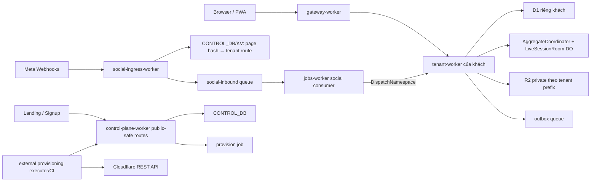

# Thiết kế kỹ thuật — Forge Social Commerce SaaS

Trạng thái: Pha 3, chờ duyệt Cổng 3  
Nguồn nghiệp vụ: `docs/BRD_SOCIAL_COMMERCE_SAAS.md`  
Field Ledger: `docs/FIELD_LEDGER_SOCIAL_COMMERCE_SAAS.md`

## 1. Quyết định kiến trúc

Forge Social không phải codebase mới. Nó mở rộng monorepo hiện có bằng bốn lát cắt:

| Lát cắt | Vị trí đích | Trách nhiệm |
|---|---|---|
| Public/SaaS UI | `client/apps/runtime` + manifest/nav server-driven | Landing, signup, portal, tenant screens; một bundle chung. |
| Social tenant domain | package mới `server/packages/social-commerce` | Normalize event, rule engine, cart, reservation, shipping/COD orchestration; không chứa transport HTTP. |
| Social ingress | app mới `server/apps/social-ingress-worker` | Meta verify/challenge, page-directory lookup, Queue; không lưu nội dung khách. |
| Control plane mở rộng | `server/apps/control-plane-worker`, `server/migrations/control/0002_*` | signup/trial/tenant/plan/job/channel route/audit; không chứa order/message/token. |

Tenant API tiếp tục nằm trong `server/apps/tenant-worker`; Frappe metadata/DocType cho list/form/report được phát hành bằng app `social-commerce` trong `server/apps-src/`. Những luật phải đọc/ghi nguyên tử dùng controller/service TypeScript, không cố biểu diễn bằng JSON.

## 2. Sơ đồ runtime

## 3. Ranh giới dữ liệu và tenant

- D1 mỗi tenant vẫn là hàng rào vật lý chính; giữ `tenant_id` ở schema hiện có để tương thích kernel nhưng không dùng nó thay cho binding check.
- `resolveTenant()` hiện tại tiếp tục fail-closed khi routed tenant khác `env.TENANT_ID`.
- Control DB chỉ giữ tenant/plan/subscription/job và `channel_routes(page_key_hmac, tenant_id, worker_name)`. `page_id` được HMAC bằng directory key để giảm lộ identifier; không có comment, SĐT, đơn hoặc credential.
- OAuth credential chỉ trong D1 khách, AES-GCM ciphertext + nonce + key version; AAD=`tenant_id\nconnection_id\nprovider`. KEK lấy từ Workers Secret/Secrets Store, không ở JSONC/D1/log.
- Raw webhook payload được giới hạn kích thước, chuyển Queue; tenant lưu ciphertext theo retention. Ingress không persist payload.
- File label/evidence private ở R2; truy cập bằng route permission hoặc signed URL TTL ngắn.

## 4. Meta OAuth và webhook

### OAuth

1. `POST /api/social/connections/facebook/authorize`: session + role Owner; tạo 32-byte state bằng `crypto.getRandomValues`, lưu SHA-256/state hash TTL 10 phút.
2. Redirect đến Meta OAuth với scopes tối thiểu đã được App Review phê duyệt; không xin scope dự phòng.
3. `GET /api/social/connections/facebook/callback`: atomic consume state (`UPDATE ... used_at IS NULL` rowcount=1), đổi code server-side, đọc Pages/scopes.
4. Chủ chọn Page; tenant mã hóa Page token, tạo connection; control-plane internal route đăng ký `page_key_hmac→tenant/worker`.
5. Subscribe Page webhooks. Thiếu scope/page mismatch → không chuyển `connected`.
6. Refresh/health job kiểm token; revoke/disconnect xóa ciphertext sau khi unsubscribe, giữ metadata/audit.

### Webhook ingress

- `GET /webhooks/facebook`: verify token challenge bằng secret constant-time.
- `POST /webhooks/facebook`: đọc bounded raw body; verify `X-Hub-Signature-256` trên raw bytes trước JSON; reject >256 KiB/invalid signature.
- Extract page ID tối thiểu sau verify; derive `page_key_hmac`; lookup route. Unknown Page trả 200 và metric cảnh báo, không tiết lộ.
- Queue message `{schema_version, provider, route, received_at, trace_id, raw_body_base64}`; ACK 200 ngay sau Queue send.
- Consumer dispatch bằng `DispatchNamespace`, không public fetch; tenant claim `UNIQUE(provider,event_id)` trước side effects.
- Nếu provider không có stable event ID, derive SHA-256 canonical `(page, object, verb, external message/comment id, event time)`; lưu derivation version.
- Queue retry exponential; sau max attempts ghi tenant event `dead_letter` và platform metric, không mất im lặng. Reconciliation cursor fetch delta từ Graph API.

## 5. Realtime livestream

- `LiveSessionRoom` Durable Object theo `tenant_id:live_session_id` giữ WebSocket hibernation connections và sequence watermark; không giữ dữ liệu lâu dài.
- Tenant consumer commit event/message vào D1 trước, sau đó `ctx.waitUntil()` notify room. Client reconnect gửi last sequence; server đọc missing messages từ D1 rồi nối live.
- Backpressure: UI batch tối đa 100 events/250ms; room gửi watermark thay vì payload vô hạn khi client chậm.
- DO không quyết định order/stock; mọi mutation đi qua tenant service/AggregateCoordinator.

## 6. Rule engine, cart và reservation

### Rule engine

- Match order: exact > prefix > token sequence; regex chỉ dùng RE2-safe/allowlisted parser, không chạy regex người dùng tùy ý gây ReDoS.
- Rule version immutable sau publish; session pin `ruleset_version` để cùng một live không đổi nghĩa giữa chừng.
- Output trung lập: `{rule_id,item_code,variant_key,qty,confidence,evidence}`; AI output chỉ suggestion, không bypass rule/permission.

### Cart aggregation

- Stable key mặc định `(provider,page_id,external_user_id,live_session_id)`.
- Gom nhiều post/live chỉ khi policy bật; cross-identity merge cần verified phone hoặc nhân viên xác nhận.
- `source_message_id UNIQUE` chống một comment vào hai cart/order; lineage không xóa khi merge/split.

### Inventory reservation

- Không thay stock ledger hiện có. Reservation là projection cam kết tạm thời.
- `available = stock_balance.actual_qty_micros - SUM(active reservations)`.
- Một Durable Object `InventoryReservationCoordinator` theo `tenant:item:warehouse` serialize reserve/release/commit; D1 UNIQUE idempotency vẫn là hàng rào retry.
- Reserve transaction/batch: validate item/order → atomic insert reservation → create/update draft lines → audit. Nếu thiếu tồn, không side effect.
- Expiry sweep chạy từ `jobs-worker` maintenance, claim `reserved AND expires_at<=now`, chuyển `expired`; retry idempotent.
- Confirm Sales Order: cùng command id tạo order; reservation `reserved→committed`. Cancel/timeout `reserved→released`; committed không release trực tiếp, đi qua cancel/return kernel.

## 7. Shipping, printing và COD

- Interface provider: `quote`, `createShipment`, `cancelShipment`, `getLabel`, `track`, `reconcileCod`; DTO trung lập, adapter giữ chữ ký/provider fields.
- Outbound call có `idempotency_key`; nếu provider không hỗ trợ, bảng `provider_operations` claim unique và lưu external ref trước retry logic.
- Provider secret nằm Worker Secret; tenant-specific merchant credential mã hóa D1 như OAuth.
- Label PDF/thermal lưu R2 private; `print_jobs` chống double print nhưng cho reprint có reason/audit.
- Shipment webhook/polling cùng idempotency pattern; event out-of-order chỉ apply nếu state transition hợp lệ và provider occurred_at/version mới hơn.
- Delivered COD chỉ tạo receivable state. `CODLine matched→posted` mới gọi Payment Entry kernel với deterministic command ID; unique `(provider,cycle_ref,tracking_code)` và source link chống double-credit.

## 8. Control plane, signup và provisioning

- Public control routes tách khỏi operator routes; signup/verify có rate limit, Turnstile ở ngưỡng rủi ro, password policy hiện có.
- `Tenant`: `pending_verification→provisioning→trial→active→past_due→limited→suspended`; `manual_hold`/`terminated` theo BRD.
- Trial 14 ngày; entitlement signed Ed25519. Tenant chỉ có public key; transport HMAC không dùng ký license.
- Provisioning executor chạy ngoài request Worker, dùng desired state + lease + step idempotency. Hiện script `provision-tenant.mjs` yêu cầu DB ID; thiết kế mới bọc nó bằng plan/apply/verify, không nhét account API token vào tenant/control Worker.
- Control→tenant dùng HMAC per tenant: timestamp ±300s, nonce atomic D1, canonical method/path/tenant/timestamp/nonce/bodyHash, `crypto.subtle.verify`; key rotation current/previous.
- Route status hiện chỉ `active|suspended|provisioning`; migration mở rộng hoặc map lifecycle riêng, gateway chỉ cần routing status tối thiểu. Billing/lifecycle source of truth không nằm KV.

## 9. API surface

### Public/control

| Method/route | Auth | Quyền/logic |
|---|---|---|
| `POST /v1/public/signup` | public | rate limit, consent, create verification only |
| `POST /v1/public/verify-email` | one-time token | atomic consume, enqueue provision |
| `GET /v1/public/plans` | public | active published plans only |
| `GET /v1/portal/subscription` | owner | own tenant only |
| `POST /v1/portal/export` | owner | rate-limit, job |
| `GET/POST /v1/admin/tenants...` | platform RBAC | list/detail/lifecycle/reconcile/reason/audit |
| `POST /v1/internal/channel-routes` | HMAC/internal | register/remove page hash route |
| `POST /v1/internal/provision-jobs/:id/{claim,step,verify}` | executor credential | lease/idempotency/evidence |

### Tenant social

| Method/route | Permission |
|---|---|
| `POST /api/social/connections/facebook/authorize` | Owner |
| `GET /api/social/connections/facebook/callback` | state + Owner session |
| `POST /api/social/connections/facebook/pages/:id/connect` | Owner |
| `DELETE /api/social/connections/:id` | Owner + reason |
| `GET /api/social/pages|live-sessions|conversations|messages` | scoped social read |
| `POST /api/social/conversations/:id/{assign,reply,complete}` | Manager/Agent scoped |
| `CRUD /api/social/rules` + `/publish` + `/simulate` | Owner/Manager |
| `POST /api/social/messages/:id/cart` | Agent+ |
| `POST /api/social/carts/:id/{merge,split,convert}` | Agent+/Manager for merge |
| `GET/POST /api/social/orders...` | Sales permission + state machine |
| `POST /api/social/reservations/{reserve,release}` | internal domain action; never raw public adjustment |
| `GET/POST /api/social/shipments...` | Warehouse/Manager |
| `GET/POST /api/social/cod...` | COD/Owner |
| `CRUD /api/social/minigames...` | Owner/Manager |
| `GET /api/social/reports/:report` | report permission + scope |
| `POST /api/social/import/:entity`, `GET /export/:entity` | entity import/export permission |
| `GET /api/social/live/:id/ws` | session + scoped read, WebSocket upgrade |

Mọi body/query/param dùng Zod shared. Error envelope giữ kiểu Forge `{error:{code,message},trace_id}`; không tạo chuẩn lỗi thứ hai.

## 10. Package và migration mapping

| Artifact | Kế hoạch |
|---|---|
| `server/packages/social-commerce` | pure/domain services, provider ports, D1 repositories, Zod DTO; test unit/integration. |
| `server/apps/social-ingress-worker` | Meta verification + Queue binding + metrics only. |
| `server/apps/tenant-worker` | route adapter, DO exports, repositories wired to env DB/R2/Queue. |
| `server/apps/jobs-worker` | `social-inbound` consumer + maintenance/reconciliation scheduler. |
| `server/apps/control-plane-worker` | public portal/admin/internal routes; replace single global bearer for user-facing admin with session/RBAC. |
| `server/apps-src/social-commerce` | manifest, roles, DocTypes/workflows/reports/nav. |
| `server/migrations/tenant/0019_social_commerce.sql` | new tenant tables/indexes/triggers; no platform data. |
| `server/migrations/control/0002_saas_platform.sql` | tenant/plan/subscription/job/audit/channel directory. |
| `client/apps/runtime` | public routes + social experiences; reuse shell/views; lazy chunks for live, charts, xlsx. |

## 11. Security and privacy controls

- Minimum Meta scopes, App Review evidence pages, data deletion callback/status, consent ledger, retention per table.
- Credential/log redaction keys: `access_token`, `refresh_token`, `app_secret`, `signature`, raw authorization, reset token/password.
- Structured logs: trace/tenant hash/event hash/status/latency; never message/address/token.
- CSP, secure cookies, CSRF for session mutations; OAuth state one-time; callback redirect allowlist.
- Webhook raw body bounded; JSON depth/entry limits; queue payload size guard.
- Rate limits by IP/session/tenant/Page; live burst quota by plan with visible degradation, never silent drop.
- Support access explicit owner grant, TTL, reason, audit; Control staff cannot query tenant D1 directly.
- Data export/delete workflows respect financial/audit retention: anonymize identity while retaining statutory transaction evidence when required.

## 12. Observability, cron và SLO

- Metrics: webhook verify reject, ingest→commit latency, queue age/retry/DLQ, live fanout lag, OAuth expiry, Graph rate limit, reservation conflict/expiry, shipment provider latency, COD variance, provisioning step duration.
- Targets: webhook ACK p95 <500ms; ingest→Inbox p95 <3s; order/reserve p95 <1s; no acknowledged event lost; RPO tenant backup 24h initially.
- Jobs Worker schedules: minute maintenance (outbox/reservation), 5-minute OAuth/webhook health, hourly reconciliation, morning expiry/dunning, evening report, nightly backup.
- Alerts include trace ID + tenant ID hash + runbook link; no secrets/PII.

## 13. Test strategy

- Unit: rule parser, normalized DTO, state machines, money/qty, encryption envelope, signature canonicalization.
- Integration D1: every Field Ledger required/unique/enum/FK; webhook replay; OAuth state replay; cart merge lineage; reservation race; shipment operation replay; COD double-post; audit rollback.
- Workerd: ingress raw signature/bounds/Queue; dispatch tenant mismatch; HMAC timestamp/nonce/replay; route scope bypass.
- Cross-tenant: Page directory A never dispatches B; forged routed header fails; tenant A IDs return 404/403 in B.
- E2E: landing→signup→trial onboarding; Page sandbox connect; replay fixture→Inbox→cart→reserve→order→shipment→COD match; low role direct API blocked.
- Browser evidence 390/412/768/1280 for S13, S01/S02, S17, S06, S09, S11/S12; 3-column/history/AI/Kanban reason verified visually.

## 14. Rollout and compatibility

- Feature flags per tenant: `social.facebook`, `social.live`, `shipping`, `cod`, `minigame` enforced server-side.
- Migrations additive; existing tenants without entitlement see no nav/routes and retain current behavior.
- Wave 1 provider uses Meta sandbox/test Page and manual shipping adapter; production Meta approval/carrier secrets are release prerequisites, not code assumptions.
- Backfill/reconcile jobs resumable; no table rename/removal in first release.

## 15. Scorecard Cổng 3

| Tiêu chí | Đạt | Bằng chứng |
|---|:-:|---|
| Mapping đúng kiến trúc Forge | ✅ | §1, §10 |
| Control DB tách tenant data | ✅ | §3 |
| OAuth/webhook/credential boundary | ✅ | §4, §11 |
| Realtime + burst strategy | ✅ | §5 |
| Reservation race/idempotency | ✅ | §6 |
| Shipping/COD double-credit guard | ✅ | §7 |
| Provisioning/HMAC/license | ✅ | §8 |
| API + quyền server rõ | ✅ | §9 |
| Test/observability/rollout | ✅ | §12–14 |
| Field Ledger đầy đủ | ✅ | File ledger riêng; 29 bảng mới/29 ledger, state machines § cuối file |

Kết luận: thiết kế đủ điều kiện trình duyệt Cổng 3; chưa viết code/migration thực thi.
