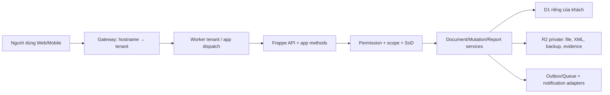

# Thiết kế kỹ thuật chi tiết — ERP Platform Wave 1

## 1. Mục tiêu và lát cắt build

Wave 1 nâng Forge thành nền ERP tổng quát theo bốn lát cắt có thứ tự cưỡng chế:

1. **G03 — Organization & SoD:** cây Công ty → Chi nhánh → Phòng ban, phạm vi người dùng, policy, ủy quyền, phê duyệt và audit.
2. **G01 — Kế toán Việt Nam:** chế độ kế toán versioned, TT99, kỳ, ghi sổ, thuế/hóa đơn điện tử, đối soát.
3. **G02 — HR/payroll:** hồ sơ, hợp đồng, chấm công/nghỉ/ca, lương, self-service và payroll → GL.
4. **G11 — Reliability:** backup, restore rehearsal, verify evidence, release/canary/rollback, incident.

Không cắt phạm vi giữa các lát cắt. G02 không post GL trước khi G03 và G01 đạt invariant; G11 là điều kiện release chứ không phải việc làm sau.

## 2. Kiến trúc chạy

Chuỗi mutation chuẩn:

`request-id/correlation → session → tenant resolve → recent-auth nếu cần → DocPerm → scope → Zod → optimistic lock → idempotency receipt → domain invariants/SoD → D1 transaction → audit/outbox → response`.

Read/report dùng replica khi an toàn; command-side read dùng primary bookmark chain. Tenant/scope không hợp lệ trả 403/404 theo chính sách chống dò dữ liệu, không fallback sang tenant mặc định.

## 3. Mô hình dữ liệu

### 3.1 Lưu trữ logic

- Mỗi DocType độc lập là một aggregate trong `documents`; field business ở `payload_json`.
- Mỗi child table là row trong `document_children` với parent key/fieldname/idx.
- `version` là khóa optimistic locking; `command_id`/mutation receipt là khóa idempotency.
- Journal/Salary/Payroll/Policy đã có được mở rộng tại chỗ qua app manifest/custom field, không sao chép sang bảng Wave 1 khác.
- Các sổ vật lý (`gl_entries`, payment/stock ledger) chỉ được ghi bởi controller/domain service.

### 3.2 Unique và tra cứu bắt buộc

| Đối tượng | Unique/guard |
|---|---|
| Company | `code`, `tax_code` trong tenant; không đổi code sau khi có GL. |
| Branch/Department | Company + code; Department parent không tạo chu trình. |
| Organization Assignment | user + scope fingerprint + effective_from. |
| Role/SoD/Approval Policy | policy code + version; một version published/effective trên cùng scope. |
| Legal/Tax/TT99 rules | type + scope + effective interval không overlap sau publish. |
| Attendance | employee + attendance_date. |
| Payroll Accounting Batch | payroll_entry; một batch hiệu lực và một JE hiệu lực. |
| E-Invoice | provider + provider_event_id; invoice_ref chỉ có một lifecycle hiệu lực. |
| Reconciliation | kind + scope + as_of + source fingerprint. |
| Backup/Release evidence | R2 key/checksum; version + commit SHA. |

Các unique cần truy vấn JSON sẽ được hiện thực bằng generated/projection index có namespace ở Pha 5, chỉ sau benchmark và migration dry-run. Migration `0035` hiện hữu tiếp tục bảo vệ Employee/Attendance/Payroll/Journal Entry; không lặp trigger cùng ý nghĩa.

## 4. Ranh giới module

| Module | Sở hữu | Phụ thuộc |
|---|---|---|
| ERP Organization Security | assignment/policy/SoD/approval/delegation/audit query | core User/Role, HR Company/Branch/Department |
| ERP VN Accounting | policy/legal/TT99/tax/e-invoice/reconciliation; điều phối kỳ/post | Accounts, Selling/Buying, HR Payroll |
| ERP HR Payroll | mở rộng HRM; orchestration input hash, approval, GL bridge | Organization Security, VN Accounting |
| ERP Reliability | evidence/snapshot/rehearsal/release/incident | platform deployment, D1/R2/Queue |

Mỗi module chỉ truy cập module khác qua interface hoặc command/query service. Không import vòng; controller kế toán là nơi duy nhất sinh GL.

## 5. Middleware và bảo mật

- `resolveTenant()` từ session/host, kiểm tra binding và tenant id; fail-closed.
- `assertAction()` đọc DocPerm + action registry; policy chỉ thu hẹp hoặc thêm điều kiện, không tự cấp quyền ngoài role nền.
- `scopeWhere()` biên dịch company/branch/department/owner thành filter có bind parameters; không nối SQL từ JSON policy.
- `maskFields()` che bank/tax/insurance/payroll/amount theo permlevel; sự kiện unmask có audit reason.
- `assertRecentAuth()` cho MST, tax regime, policy publish, hard-lock/reopen, export-all, restore/release.
- `assertSoD()` so actor lập/duyệt/post và delegation tại thời điểm bấm.
- CSP/CSRF/session cookie theo platform; upload kiểm MIME/size, R2 private mặc định, download lại qua quyền chứng từ.

## 6. Hạ tầng dùng chung

| Năng lực | Thiết kế Wave 1 |
|---|---|
| Audit | Dùng audit/version hiện hữu; bổ sung query/evidence `Audit Event` virtual/system, immutable. |
| Counters | Series/atomic naming cho employee, policy, rule, case, backup, release, incident. |
| Files | Upload qua `upload_file`; R2 private; attachment gắn đúng DocType/name. |
| Notification | Một pipeline outbox → adapter in-app/email/Zalo; retry + dead-letter + `message_log`. |
| AI logs | Mọi gợi ý AI có input hash, tool, model, output, actor, acceptance/rejection; không tự post. |
| Webhook | E-invoice claim event id trước xử lý, xác minh chữ ký raw body, replay trả kết quả cũ. |
| Export all | Job private, recent-auth, rate limit, checksum, URL ngắn hạn, audit. |
| Offline sync | Không áp dụng do PWA/offline bị loại. |

Ba lịch định kỳ bắt buộc:

- Hàng giờ/ngày: nhắc phê duyệt, hợp đồng/ủy quyền/rule sắp hết hạn, kỳ/payroll exception.
- Hàng ngày/tuần: báo cáo kiểm soát, đối soát, SoD anomaly và SLO.
- Hàng ngày: backup theo chính sách; hàng tháng/quý restore rehearsal và reconciliation chứng nhận.

## 7. AI có kiểm soát

AI chỉ đề xuất, không submit/post/publish/release. Tool coverage mục tiêu ≥80% tác vụ phân tích trong Wave 1:

1. `explain_effective_permission`
2. `detect_sod_conflict`
3. `suggest_approval_route`
4. `classify_legal_rule_scope`
5. `check_tt99_mapping_coverage`
6. `explain_posting_preview`
7. `detect_unbalanced_or_invalid_account`
8. `suggest_reconciliation_matches`
9. `explain_payroll_variance`
10. `detect_missing_payroll_inputs`
11. `summarize_restore_reconciliation`
12. `summarize_release_gate_or_incident`

Mỗi tool có schema input/output, permission giống người gọi, nguồn/rule trace, confidence và nút chấp nhận/từ chối. Dữ liệu nhạy cảm bị mask trước prompt; không gửi attachment private ngoài tool được cấp quyền.

## 8. Kiến trúc UI

UI dùng generic runtime + metadata, palette KeToan/Toka dùng chung, icon/tên theo module. PWA bị loại; các phần shell còn lại giữ chuẩn.

| Screen | Renderer/override | Desktop | Mobile |
|---|---|---|---|
| W01–W03 tổ chức/quyền/duyệt | Tree/List/Form/Kanban + policy simulator override | sidebar thu gọn, list-detail 3 cột | BottomNav, FAB, form full-screen, tree drill-down |
| W04–W08 kế toán/TT99/kỳ/JE/đối soát | List/Form/Report/Chart/Timeline + posting preview override | bảng dày có ghim tổng, drawer, evidence panel | card list, action sheet; post cần recent-auth |
| W09–W11 HR/payroll/self-service | List/Form/Calendar/Kanban/Print + payroll workbench override | dashboard + exception rail | 4 tab HR, FAB tạo yêu cầu, payslip riêng |
| W12 reliability | Dashboard/Kanban/Timeline/Report | gate board + evidence + incident | trạng thái, cảnh báo và hành động khẩn có xác nhận |

Mọi bảng có search/filter, STT, bulk action có quyền, cột ảnh khi phù hợp, mobile card và empty/loading/error/permission/success. Kanban backward/cancel bắt buộc lý do. Form dùng link field searchable, nested create và autofill nhưng không ghi đè giá trị người dùng đã sửa. Detail có Timeline/Lịch sử cho entity nghiệp vụ.

## 9. Tính tương thích và triển khai

- Meta package được validator độc lập kiểm tra ở Pha 3.
- Pha 5 tạo/đổi manifest theo từng module, migration additive và feature flag theo tenant.
- Rollout: G03 canary → G01 shadow/posting oracle → G02 payroll shadow → G11 bắt buộc trước production rộng.
- Không chạy migration ở Pha 3. SQL/index/trigger chỉ là kế hoạch; backup và dry-run trước áp dụng.

## 10. Tiêu chí kỹ thuật khóa trước build

- Cross-tenant và cross-scope test fail-closed.
- Mọi mutation tài chính/payroll/quyền/release có idempotency, optimistic lock, audit và SoD test.
- Rule pháp lý chọn theo effective date; trường hợp thiếu nguồn trả `need_legal_check=true`, `postable=false`.
- Debit = credit; kỳ/account hợp lệ; nguồn → chứng từ → GL/subledger → report/tax/XML truy vết được.
- Không hard delete sau post; reverse/amend giữ nguyên bằng chứng.
- Restore rehearsal chứng minh count/hash/ledger balance; release không xanh thì không deploy.
