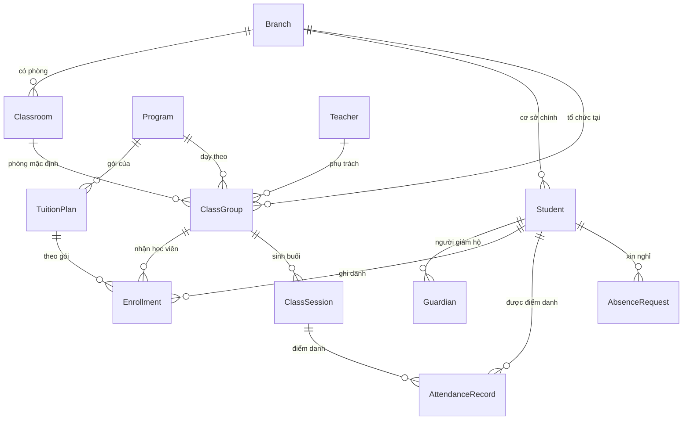

# DATA MODEL — CloudForge Center v1 (Pha 1–2)

Nguồn sự thật: `server/briefs/center.json`. Tên DocType tiếng Anh, nhãn tiếng Việt — đúng quy ước
app sẵn có và tránh mã hoá URL với tên có dấu.

| DocType | Nhãn | Đặt tên | Workflow |
|---|---|---|---|
| Branch | Cơ sở | `CS-.####` | — |
| Classroom | Phòng học | `PH-.####` | — |
| Student | Học viên | `HV-.YYYY.-#####` | — |
| Guardian | Phụ huynh | `PH-.YYYY.-#####` | — |
| Teacher | Giáo viên | `GV-.####` | — |
| Program | Chương trình | `CT-.####` | — |
| Tuition Plan | Gói học | `GH-.####` | — |
| Class Group | Lớp học | `LOP-.YYYY.-####` | — |
| Enrollment | Ghi danh | `GD-.YYYY.-#####` | **Duyệt ghi danh** |
| Class Session | Buổi học | `BH-.YYYY.-#####` | **Vòng đời buổi học** |
| Attendance Record | Điểm danh | `DD-.YYYY.-#####` | — |
| Absence Request | Đơn xin nghỉ | `XN-.YYYY.-#####` | **Duyệt đơn xin nghỉ** |

## Trường chỉ đọc — và vì sao

`Enrollment.sessions_used` và `Absence Request.makeup_granted` khai `~` (read-only). Server **từ chối**
mọi lần client cố ghi. Số buổi đã dùng mà client đặt được là số buổi client giả mạo được (§19: server
là nguồn sự thật cho session balance). Chính seeder đầu tiên đã bị từ chối vì gửi `sessions_used` —
nền tảng đúng, seeder sai.

## CHƯA có trong v1 (thuộc GAP-2/4/5)

`Receivable`, `Payment`, `Receipt`, `CreditBalance`, `Refund`, `MakeupCredit`, `MakeupBooking`,
`FreezeRequest`, `TeachingRecord`, `TeacherEarning`, `Lead`, `StudentDocument`.
